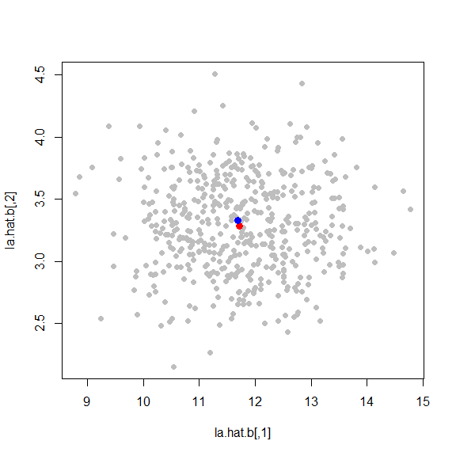
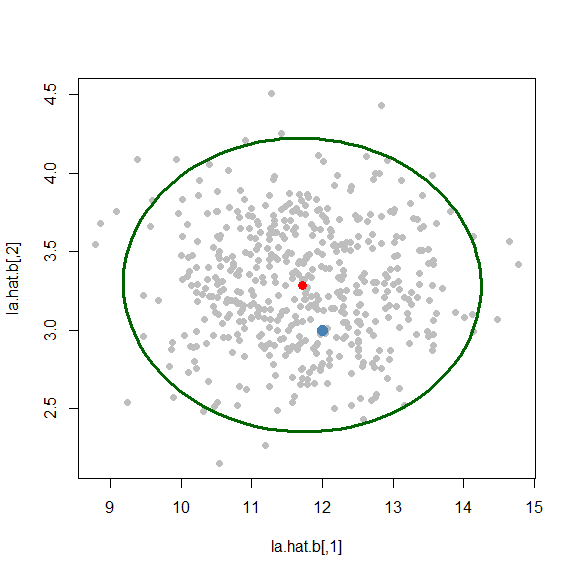

STAT547O - Bootstrap notes
================
Matias Salibian-Barrera
2019-11-22

#### LICENSE

These notes are released under the “Creative Commons
Attribution-ShareAlike 4.0 International” license. See the
**human-readable version**
[here](https://creativecommons.org/licenses/by-sa/4.0/) and the **real
thing**
[here](https://creativecommons.org/licenses/by-sa/4.0/legalcode).

# DRAFT (Read at your own risk)

## The Fast and Robust Bootstrap

Before we describe the fast and robust bootstrap (FRB) we briefly
illustrate the use of the non-parametric bootstrap (Efron 1979) with a
less-trivial example than the ones often used in tutorials.

### Efron’s non-parametric Bootstrap

Consider the problem of constructing a confidence region (or confidence
intervals) for the eigenvalues of the covariance matrix of a random
vector. To simplify the presentation we consider here a bi-variate case
`p = 2`). In order to construct these confidence sets we need to
estimate the (joint) distribution of the eigenvalue estimators. We will
use non-parametric boostrap to do this.

We first generate a random sample of `n = 200` observations from a
2-dimensional Gaussian random vector with mean 0. The true covariance
matrix has eigenvalues 12 and 3, and we randomly pick the corresponding
eigenvectors (from a uniform distribution on the unit ball). If `U` is
the matrix containing the eigenvectors as columns (so that `U'U = I`),
then the covariance matrix of the bi-variate random vector is `\Sigma =
U \Lambda U^T`, where `\Lambda = diag(12, 3)`.

``` r
p <- 2
set.seed(123456)
u <- qr.Q( qr( matrix(rnorm(p*p), p, p) ) )
la <- c(12, 3) 
sigma <- u %*% diag(la) %*% t(u) 
```

We now take the random sample of `n = 200` observations:

``` r
n <- 200
set.seed(123456)
x <- MASS::mvrnorm(n=n, mu=rep(0,p), Sigma=sigma)
```

The estimated eigenvalues of the true covariance matrix `\Sigma` are:

``` r
( la.hat <- svd(cov(x))$d )
```

    ## [1] 11.69325  3.32978

(recall that the true ones are 12, 3). To construct 95% confidence
intervals for the each of the true eigenvalues, or build a 95%
confidence region for both of them simultaneously we need to estimate
the distribution of the random vector `(\hat{\lambda}_1,
\hat{\lambda}_2)^T`. The non-parametric bootstrap (Efron 1979) estimator
for this distribution. is the “empirical” (Monte Carlo) distribution
obtained by re-computing the estimator on `B` samples obtained from the
original sample, with replacement. In this example we will use `B = 500`
bootstrap samples.

For each sample we will compute the eigenvalues of the corresponding
sample covariance matrix. The empirical distribution of these 500
bi-variate vectors constitutes the nonparametric bootstrap estimate of
the distribution of interest. We will save these 500 vectors in the
matrix `la.hat.b` below. The main bootstrap loop is below. In each step
we draw a sample from the original sample and compute the eigenvalues of
the sample covariance matrix.

``` r
B <- 500
la.hat.b <- array(0, dim=c(B, p))
set.seed(123456)
for(j in 1:B) {
  ii <- sample(n, repl=TRUE)
  la.hat.b[j, ] <- svd( cov(x[ii,]) )$d
}
```

The plot below displays the estimated distribution of the vector of
eigenvalues etimators. The red point is the center of the estimated
distribution, and the blue point is the original vector of estimated
eigenvalues.

``` r
plot(la.hat.b, pch=19, col='gray')
la.mu <- colMeans(la.hat.b)
points(la.mu[1], la.mu[2], col='red', pch=19, cex=1.2)
points(la.hat[1], la.hat[2], col='blue', pch=19, cex=1.2)
```

<!-- -->

This distribution looks fairly elliptical (and Gaussian). We can draw a
95% confidence region based on this observation (the green ellipse
below). Note that the the true vector of eigenvalues (indicated with a
light blue point on the plot) falls inside the confidence region.

``` r
aa <- var(la.hat.b) 
plot(la.hat.b, pch=19, col='gray')
xx <- ellipse::ellipse(aa, centre=la.mu)
lines(xx, cex=.7, col='darkgreen', lwd=3)
points(la.mu[1], la.mu[2], col='red', pch=19, cex=1.2)
points(la[1], la[2], col='steelblue', pch=19, cex=1.5)
```

<!-- -->

To build marginal confidence intervals, we use quantiles of the
estimated marginal distributions. For the first eigenvalue:

``` r
qs <- as.numeric( quantile(la.hat.b[,1] - la.mu[1], c(.025, .975)) )
c(la.mu[1] - qs[2], la.mu[1] - qs[1])
```

    ## [1]  9.855476 13.550389

and for the second eigenvalue:

``` r
qs <- as.numeric( quantile(la.hat.b[,2] - la.mu[2], c(.025, .975)) )
c(la.mu[2] - qs[2], la.mu[2] - qs[1])
```

    ## [1] 2.577254 4.027706

### Fast and Robust Bootstrap (for an M-estimator of location)

In this note we discuss the Fast and Robust Bootstrap (FRB) in the
simple case of M-estimators for a location parameter. The FRB has been
applied to many several models and estimators. A review paper is SB, Van
Aelst, & Willems (2008) Fast and robust bootstrap, *Statistical Methods
and Applications*, 17(1): 41-71.
[DOI](https://doi.org/10.1007/s10260-007-0048-6); and the original paper
is SB & Zamar (2002) Bootrapping robust estimates of regression, *The
Annals of Statistics*, 30(2), 556-582
[DOI](https://doi.org/10.1214/aos/1021379865).

When bootstrapping robust estimators with data that may contain ayptical
observations two main issues arise: (a) re-computing the robust
estimator several hundred times may be computationally too constly (or
unfeasible); and (b) some of the bootstrap samples may contain a larger
proportion of outliers than in the original sample, and thus the
bootstrapped estimators may be heavily influenced by them.

The Fast and Robust Bootstrap avoids both problems above: it is very
fast (for each bootstrap sample we only need to compute a weighted
average or weighted least squares estimator), and since each point in
the sample is associated with their estimating equations weights (which
are typically low for observations that were not well fit), outliers
will be downweighted and thus will not affect the bootstrapped
estimators.

We described this method in class. Here is an application to the
simplest M-estimator of location (where the residual scale is assumed
known).

We first create a toy example with a synthetic simple data set
consisting of `n = 50` observations, including 10% of outliers following
a `N(5, 0.01)` distribution:

``` r
set.seed(123456)
n <- 50
ep <- .1
n0 <- floor(n*(1-ep))
x <- c(rnorm(n0), rnorm(n-n0, mean=5, sd=.1))
```

The true location parameter is 0, the sample mean is 0.648 and the
sample median is 0.18.

We now compute a robust M-estimator using a bisquare score function
(tuned to achieve 90% efficiency if no outliers were present in the
data), and the usual iterative re-weighted least-squares algorithm. Note
that in this example we estimate the residual scale with the MAD and
keep it fixed (essentially assuming that the scale is known). The proper
way to do this is, of course, to include the scale estimation step in
the process (see the references at the top of this section).

We first write a simple function to compute the M-estimator with the
iterative re-weighted least-squares algorithm (which are re-weigthed
averages in this simple setting):

``` r
Mlocation <- function(x, cc0, si.hat, max.it=100, tol=1e-7) { 
  mu.hat <- median(x)
  rhoprime <- function(r, family='bisquare', cc=cc0) {
    return(RobStatTM::rhoprime(r, family=family, cc=cc) )
  }
  mu.old <- mu.hat + 10*tol
  j <- 0
  while( (j  < max.it) & (abs(mu.old - mu.hat) > tol) ) {
    mu.old <- mu.hat
    re <- (x - mu.hat) / si.hat
    w <- rhoprime(re) / re
    w[ abs(re) < .Machine$double.eps ] <- 1
    mu.hat <- sum(w * x ) / sum(w)
    j <- j + 1
  }
  return(mu.hat)
}
```

We now use this function to compute the M-estimator:

``` r
cc0 <- RobStatTM::lmrobdet.control(family='bisquare', 
                                   efficiency=.9)$tuning.psi
si.hat <- mad(x) 
( round(mu.hat <- Mlocation(x, cc0=cc0, si.hat=si.hat), 3) )
```

    ## [1] 0.19

As discussed in class, bootstrapping using the above fixed
estimating-equation-weights (`w`) can be expected to underestimate the
variability of the target distribution, but this can be corrected by
applying a simple correction factor (which can be derived using a Taylor
expansion of the fixed-point estimating equations). We now compute this
correction factor, which in this setting is a scalar (`corr.f` below):

``` r
re <- (x - mu.hat)/si.hat
w <- RobStatTM::rhoprime(re, family='bisquare', cc=cc0) / re
tmp1 <- RobStatTM::rhoprime(re, family='bisquare', cc=cc0)
tmp2 <- RobStatTM::rhoprime2(re, family='bisquare', cc=cc0)
wprime <- (tmp1 - tmp2*re)/re^2
swp <- sum(wprime)
wwprime <- ( wprime * sum(w) - wprime * swp ) / ( sum(w) )^2
corr.f <- 1 / ( 1 - sum( wwprime * x ) ) 
```

We now compute the 500 bootstrapped M-estimators. Note that, instead of
running the above re-weighted least squares iterations (re-weighted
means in this simple setting) until convergence to compute the
M-estimator with each bootstrap sample, we only need to compute a
weighted average of the form `sum(w*x)/sum(w)`, which is very fast,
using the bootstrap sample of `x`’s and their corresponding weights
`w`’s:

``` r
B <- 500
mu.hat.b <- vector('numeric', B)
set.seed(123456)
system.time({ 
  for(j in 1:B) {
    ii <- sample(n, repl=TRUE)
    mu.hat.b[j] <- sum( w[ii] * x[ii] ) / sum( w[ii] )
  }
})
```

    ##    user  system elapsed 
    ##       0       0       0

Note the running time, which we will compare below with the time it
takes to run the standard bootstrap.

Next we use the quantiles of the centered and corrected bootstrap
distribution to construct the 95% confidence interval for the true
location parameter:

``` r
boot.cc <- corr.f*(mu.hat.b - mu.hat)
uu <- quantile( boot.cc, c(.025, .975))
c( mu.hat - uu[2], mu.hat - uu[1])
```

    ##      97.5%       2.5% 
    ## -0.1825118  0.5520503

#### Bootstraping the M-estimator “by hand”

We now use the non-parametric bootstrap to estimate the distribution of
the M-estimator of location (keeping the scale fixed). We show the
required running time, to compare it with that of the FRB:

``` r
si.hat <- mad(x)
B <- 500
mu.hat.b2 <- vector('numeric', B)
set.seed(123456)
system.time({
  for(j in 1:B) {
    ii <- sample(n, repl=TRUE)
    mu.hat.b2[j] <- Mlocation(x[ii], cc0=cc0, si.hat=si.hat)
  }
})
```

    ##    user  system elapsed 
    ##    0.21    0.00    0.20

Note that, even in this very simple example, the FRB is much faster
(0.20s vs 0s of CPU time?) than the usual bootstrap for these
estimators. The resulting confidence interval is very similar:

``` r
uu <- quantile( mu.hat.b2 - mu.hat, c(.025, .975))
c( mu.hat - uu[2], mu.hat - uu[1])
```

    ##      97.5%       2.5% 
    ## -0.1705701  0.5192381

### Confidence intervals based on the mean and the median

Finally, we compare the confidence interval based on the M-estimator
with those based on the sample mean and the sample median. It is not
surprising that the classical 95% confidence interval based on the
sample mean fails to contain the true value (zero):

``` r
c(mean(x) - qnorm(.975) * sd(x)/sqrt(n), 
mean(x) + qnorm(.975) * sd(x)/sqrt(n))
```

    ## [1] 0.1593878 1.1368002

To construct a confidence interval based on the sample median we require
an estimate of the density of the error distribution. Using a kernel
estimator we get:

``` r
a <- summary(quantreg::rq(x ~ 1), se='ker')$coef
c( a[1] - qnorm(.975) * a[2], a[1] + qnorm(.975) * a[2])
```

    ## [1] -0.6402878  0.9823529

Using bootstrap:

``` r
a <- summary(quantreg::rq(x ~ 1), se='boot')$coef
c( a[1] - qnorm(.975) * a[2], a[1] + qnorm(.975) * a[2])
```

    ## [1] -0.3495882  0.6916533

It is interesting to note that the two confidence intervals above are
noticeably wider than those computed with the M-estimator, reflecting
the gain in efficiency obtained by using an M-estimator instead of the
median.
