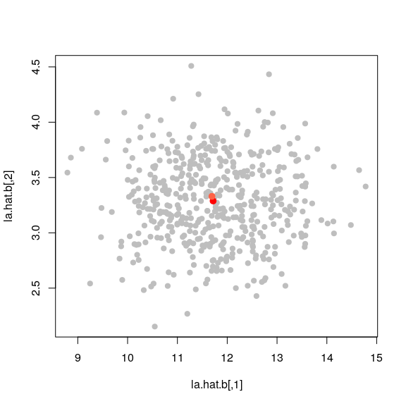
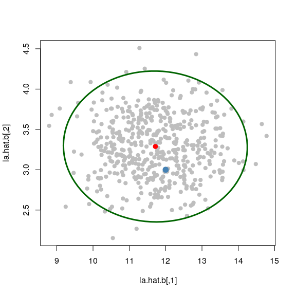
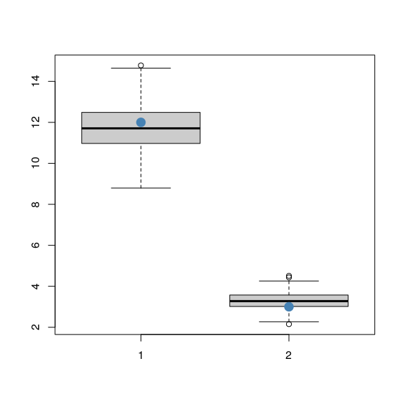

STAT547O - Bootstrap notes
================
Matias Salibian-Barrera
2019-11-21

#### LICENSE

These notes are released under the "Creative Commons Attribution-ShareAlike 4.0 International" license. See the **human-readable version** [here](https://creativecommons.org/licenses/by-sa/4.0/) and the **real thing** [here](https://creativecommons.org/licenses/by-sa/4.0/legalcode).

DRAFT (Read at your own risk)
=============================

Bootstrap
---------

Here is a simple example illustrating the use of the non-parametric bootstrap (Efron 1979) to estimate the (joint) distribution of the estimated eigenvalues of the covariance matrix of a random vector. To simplify the presentation we consider here a bi-variate case `p = 2`).

We will generate a random sample of `n = 200` observations from a 2-dimensional Gaussian random vector with mean 0. We also create a covariance matrix at random (by generating a random matrix of eigenvectors) and constructing `\Sigma = U \Lambda U^T`, where `\Lambda = diag(12, 3)`.

``` r
p <- 2
# create a population covariance matrix for the example
set.seed(123456)
u <- qr.Q(qr(matrix(rnorm(p*p), p, p)))
la <- c(12, 3) # c(3, 1)
( sigma <- u %*% diag(la) %*% t(u) )
```

    ##           [,1]      [,2]
    ## [1,] 11.110840 -2.685487
    ## [2,] -2.685487  3.889160

We now generate the random sample:

``` r
n <- 200
set.seed(123456)
x <- MASS::mvrnorm(n=n, mu=rep(0,p), Sigma=sigma)
```

The estimated eigenvalues of the true covariance matrix `\Sigma` are

``` r
( la.hat <- svd(cov(x))$d )
```

    ## [1] 11.69325  3.32978

Can we construct 95% confidence intervals for the each of the true eigenvalues? Or a 95% confidence region for both of them simultaneously?

What is the distribution of the random vector `(\hat{\lambda}_1, \hat{\lambda}_2)^T` ?

We will use the non-parametric bootstrap (Efron 1979) to estimate this distribution. Our distribution estimator is the "empirical" (really: Monte Carlo) distribution obtained by re-computing the estimator on samples obtained from the original sample. In this example we will use `B = 500` bootstrap samples.

For each sample we will compute the eigenvalues of the corresponding sample covariance matrix, so we need space to save 500 vectors of dimension 2 (this is the matrix `la.hat.b` in the code chunk below). We then draw a sample, compute the eigenvalues of the sample covariance matrix and store them.

``` r
B <- 500
la.hat.b <- array(0, dim=c(B, p))
set.seed(123456)
for(j in 1:B) {
  ii <- sample(n, repl=TRUE)
  la.hat.b[j, ] <- svd( cov(x[ii,]) )$d
}
```

These 500 samples are our distribution estimator. This is how they look like. The red point is the center of the estimated distribution, and the light red point is the original vector of estimated eigenvalues.

``` r
plot(la.hat.b, pch=19, col='gray')
la.mu <- colMeans(la.hat.b)
points(la.mu[1], la.mu[2], col='red', pch=19, cex=1.2)
points(la.hat[1], la.hat[2], col='tomato', pch=19, cex=1.2)
```



This distribution looks fairly elliptical (and Gaussian). We can draw a 95% confidence interval using this. The light blue point is the true vector of eigenvalues.

``` r
aa <- var(la.hat.b) 
plot(la.hat.b, pch=19, col='gray')
xx <- ellipse::ellipse(aa, centre=la.mu)
lines(xx, cex=.7, col='darkgreen', lwd=3)
points(la.mu[1], la.mu[2], col='red', pch=19, cex=1.2)
points(la[1], la[2], col='steelblue', pch=19, cex=1.5)
```



If we did marginal confidence intervals, we would use quantiles of the estimated marginal distributions

``` r
qs <- as.numeric( quantile(la.hat.b[,1] - la.mu[1], c(.025, .975)) )
c(la.mu[1] - qs[2], la.mu[1] - qs[1])
```

    ## [1]  9.855476 13.550389

``` r
qs <- as.numeric( quantile(la.hat.b[,2] - la.mu[2], c(.025, .975)) )
c(la.mu[2] - qs[2], la.mu[2] - qs[1])
```

    ## [1] 2.577254 4.027706

Another way to look at it, using boxplots:

``` r
boxplot(la.hat.b, col='gray80')
points(1, la[1], pch=19, cex=1.75, col='steelblue')
points(2, la[2], pch=19, cex=1.75, col='steelblue')
```



**Spoiler alert**: we do know the asymptotic distribution of each eigenvalue estimator ( `N(\lambda_j, 2*\lambda_j^2 / n)` ).

**Sanity check**:

``` r
diag( var(la.hat.b) )
```

    ## [1] 1.0699676 0.1460712

``` r
2*la.hat^2/n
```

    ## [1] 1.3673209 0.1108744

The asymptotic CI would have been

``` r
c(la.hat[1] - qnorm(.975)*sqrt(2*la.hat[1]^2/n), 
  la.hat[1] + qnorm(.975)*sqrt(2*la.hat[1]^2/n) )
```

    ## [1]  9.401415 13.985085

``` r
c(la.hat[2] - qnorm(.975)*sqrt(2*la.hat[2]^2/n), 
  la.hat[2] + qnorm(.975)*sqrt(2*la.hat[2]^2/n) )
```

    ## [1] 2.677155 3.982405
