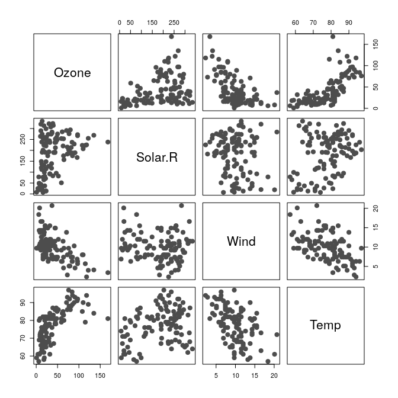
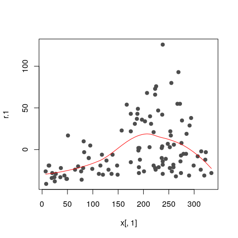
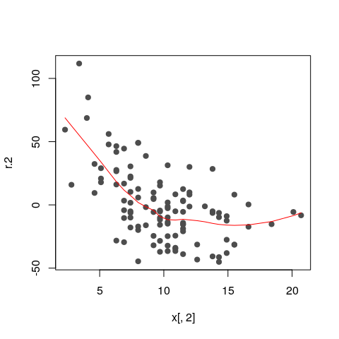
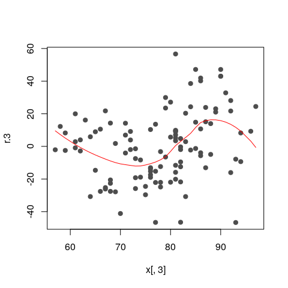
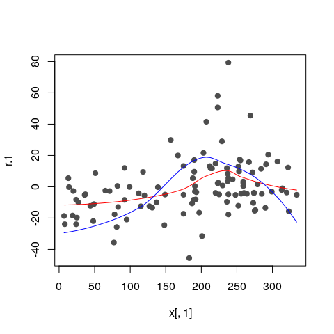
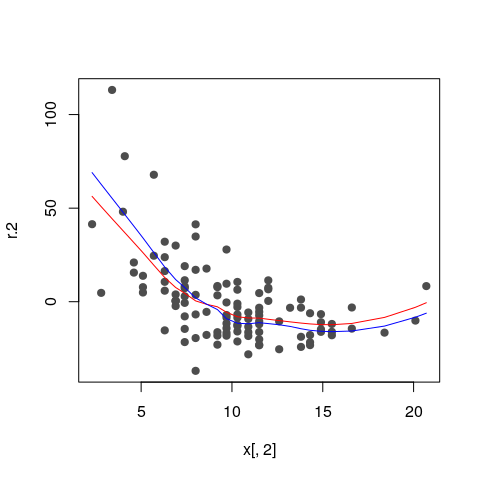
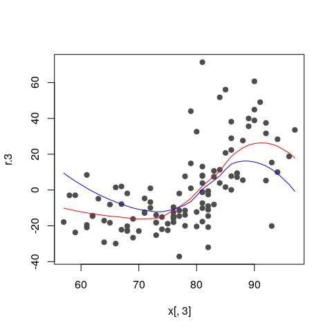
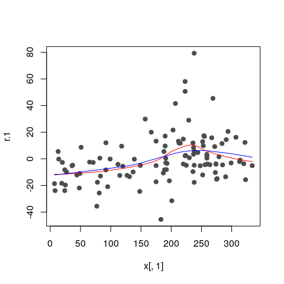
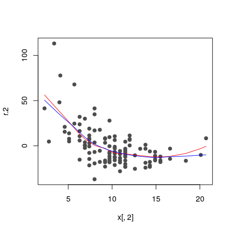

STAT547O - Backfitting notes
================
Matias Salibian-Barrera
2019-11-08

#### LICENSE

These notes are released under the "Creative Commons Attribution-ShareAlike 4.0 International" license. See the **human-readable version** [here](https://creativecommons.org/licenses/by-sa/4.0/) and the **real thing** [here](https://creativecommons.org/licenses/by-sa/4.0/legalcode).

DRAFT (Read at your own risk)
=============================

Backfitting (robust and otherwise) "by hand"
--------------------------------------------

We use the Air Quality data. To simplify the example, we will only use two explanatory variables (`Wind` and `Temp`):

``` r
library(RBF)
data(airquality)
x <- airquality
x <- x[ complete.cases(x), ]
x <- x[, c('Ozone', 'Solar.R', 'Wind', 'Temp')]
y <- as.vector(x$Ozone)
x <- as.matrix(x[, c('Solar.R', 'Wind', 'Temp')])
```

A scatter plot of the data

``` r
pairs(cbind(y,x), labels=c('Ozone', colnames(x)), pch=19, col='gray30', cex=1.5)
```



### Classical backfitting

The algorithm starts with the estimated intercept (equal to the sample mean of the response), and all the components of the additive model set to zero:

``` r
alpha.hat <- mean(y)
n <- length(y)
bandw <- 5
f.hat.1 <- f.hat.2 <- f.hat.3 <- rep(0, n)
```

We now compute *partial residuals* without using `f.hat.1`:

``` r
r.1 <- y - alpha.hat - f.hat.2 - f.hat.3
```

We smooth this vector of residuals as a function of `x1`

``` r
oo <- order(x[,1])
f.hat.1 <- fitted( loess(r.1 ~ x[,1], span=.65, family='gaussian') ) 
plot(r.1 ~ x[,1], type='p', pch=19, col='gray30')
lines(f.hat.1[oo] ~ x[oo,1], col='red')
```



Now, compute partial residuals without `f.hat.2` and smooth them as a function of `x2`,

``` r
oo2 <- order(x[,2])
r.2 <- y - alpha.hat - f.hat.1 - f.hat.3
f.hat.2 <- fitted( loess(r.2 ~ x[,2], span=.65, family='gaussian') ) 
plot(r.2 ~ x[,2], type='p', pch=19, col='gray30')
lines(f.hat.2[oo2] ~ x[oo2,2], col='red')
```



Finally, update `f.hat.3`:

``` r
oo3 <- order(x[,3])
r.3 <- y - alpha.hat - f.hat.1 - f.hat.2
f.hat.3 <- fitted( loess(r.3 ~ x[,3], span=.65, family='gaussian') ) 
plot(r.3 ~ x[,3], type='p', pch=19, col='gray30')
lines(f.hat.3[oo3] ~ x[oo3,3], col='red')
```



Iterate

``` r
f.hat.3 <- f.hat.3 - mean(f.hat.3)
f.hat.2 <- f.hat.2 - mean(f.hat.2)
f.hat.1 <- f.hat.1 - mean(f.hat.1)
f.hat.1.orig <- f.hat.1
f.hat.2.orig <- f.hat.2
f.hat.3.orig <- f.hat.3

for(i in 1:15) {
  f.hat.1.old <- f.hat.1
  f.hat.2.old <- f.hat.2
  f.hat.3.old <- f.hat.3
  
  r.1 <- y - alpha.hat - f.hat.2 - f.hat.3
  f.hat.1 <- fitted( loess(r.1 ~ x[,1], span=.65, family='gaussian') ) 

  r.2 <- y - alpha.hat - f.hat.1 - f.hat.3
  f.hat.2 <- fitted( loess(r.2 ~ x[,2], span=.65, family='gaussian') ) 

  r.3 <- y - alpha.hat - f.hat.1 - f.hat.2
  f.hat.3 <- fitted( loess(r.3 ~ x[,3], span=.65, family='gaussian') ) 

  f.hat.3 <- f.hat.3 - mean(f.hat.3)
  f.hat.2 <- f.hat.2 - mean(f.hat.2)
  f.hat.1 <- f.hat.1 - mean(f.hat.1)
  
  print(sqrt(mean((f.hat.1-f.hat.1.old)^2) + 
          mean((f.hat.2-f.hat.2.old)^2) +
          mean((f.hat.3-f.hat.3.old)^2)))
}
```

    ## [1] 9.035611
    ## [1] 3.358609
    ## [1] 1.348306
    ## [1] 0.5391672
    ## [1] 0.2063781
    ## [1] 0.07490026
    ## [1] 0.02577467
    ## [1] 0.00841483
    ## [1] 0.002605988
    ## [1] 0.0007670054
    ## [1] 0.0002178617
    ## [1] 6.330929e-05
    ## [1] 2.095538e-05
    ## [1] 8.061999e-06
    ## [1] 3.252211e-06

``` r
plot(r.1 ~ x[,1], type='p', pch=19, col='gray30')
lines(f.hat.1[oo] ~ x[oo,1], col='red')
lines(f.hat.1.orig[oo] ~ x[oo,1], col='blue')
```



``` r
plot(r.2 ~ x[,2], type='p', pch=19, col='gray30')
lines(f.hat.2[oo2] ~ x[oo2,2], col='red')
lines(f.hat.2.orig[oo2] ~ x[oo2,2], col='blue')
```



``` r
plot(r.3 ~ x[,3], type='p', pch=19, col='gray30')
lines(f.hat.3[oo3] ~ x[oo3,3], col='red')
lines(f.hat.3.orig[oo3] ~ x[oo3,3], col='blue')
```



Sanity check

``` r
library(gam)
dat <- as.data.frame(x)
dat$Ozone <- y
gg <- predict(gam(Ozone ~ lo(Solar.R, span=.65) +
                  lo(Wind, span=.65) + lo(Temp, span=.65), data=dat),
              type='terms')

plot(r.1 ~ x[,1], type='p', pch=19, col='gray30')
lines(f.hat.1[oo] ~ x[oo,1], col='red')
lines(gg[oo,1] ~ x[oo,1], col='blue')
```



``` r
plot(r.2 ~ x[,2], type='p', pch=19, col='gray30')
lines(f.hat.2[oo2] ~ x[oo2,2], col='red')
lines(gg[oo2,2] ~ x[oo2,2], col='blue')
```



``` r
# head(cbind(f.hat.1, gg[,1]))
# head(cbind(f.hat.2, gg[,2]))
# head(cbind(f.hat.3, gg[,3]))
# 
# plot(f.hat.1, gg[,1]); abline(0,1)
# plot(f.hat.2, gg[,2]); abline(0,1)
# plot(f.hat.3, gg[,3]); abline(0,1)
```
