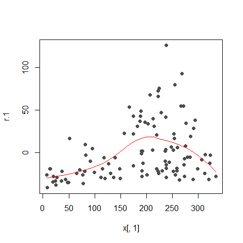
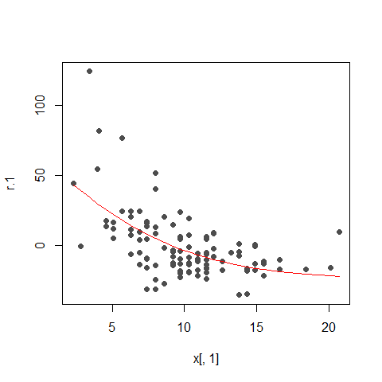
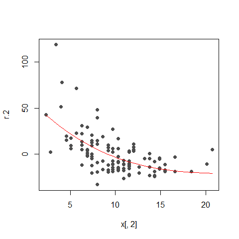
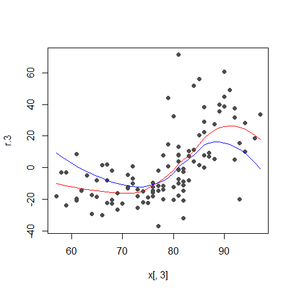
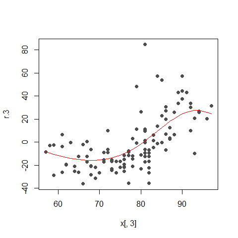
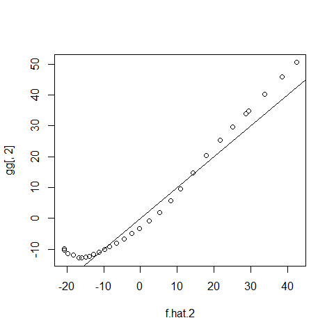
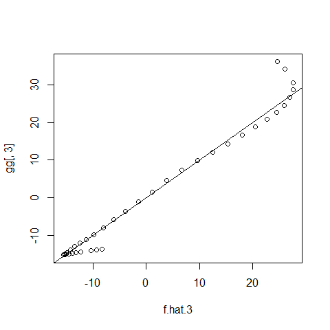

STAT547O - Backfitting notes
================
Matias Salibian-Barrera
2019-11-08

#### LICENSE

These notes are released under the “Creative Commons
Attribution-ShareAlike 4.0 International” license. See the
**human-readable version**
[here](https://creativecommons.org/licenses/by-sa/4.0/) and the **real
thing**
[here](https://creativecommons.org/licenses/by-sa/4.0/legalcode).

# DRAFT (Read at your own risk)

## Backfitting (robust and otherwise) “by hand”

We use the Air Quality data. To simplify the example, we will only use
two explanatory variables (`Wind` and `Temp`):

``` r
library(RBF)
data(airquality)
x <- airquality
x <- x[ complete.cases(x), ]
x <- x[, c('Ozone', 'Solar.R', 'Wind', 'Temp')]
y <- as.vector(x$Ozone)
x <- as.matrix(x[, c('Solar.R', 'Wind', 'Temp')])
```

A scatter plot of the data

``` r
pairs(cbind(y,x), labels=c('Ozone', colnames(x)), pch=19, col='gray30', cex=1.5)
```

<!-- -->

### Classical backfitting

The algorithm starts with the estimated intercept (equal to the sample
mean of the response), and all the components of the additive model set
to zero:

``` r
alpha.hat <- mean(y)
n <- length(y)
bandw <- 5
f.hat.1 <- f.hat.2 <- f.hat.3 <- rep(0, n)
```

We now compute *partial residuals* without using `f.hat.1`:

``` r
r.1 <- y - alpha.hat - f.hat.2 - f.hat.3
```

We smooth this vector of residuals as a function of `x1`

``` r
library(KernSmooth)
oo <- order(x[,1])
tmp <- locpoly(x=x[,1], y=r.1, degree=1, bandwidth=bandw)
tmp.f <- approxfun(x=tmp$x, y=tmp$y)
f.hat.1 <- tmp.f(x[,1])
plot(r.1 ~ x[,1], type='p', pch=19, col='gray30')
lines(f.hat.1[oo] ~ x[oo,1], col='red')
```

<!-- -->

Now, compute partial residuals without `f.hat.2` and smooth them as a
function of `x2`,

``` r
oo2 <- order(x[,2])
r.2 <- y - alpha.hat - f.hat.1 - f.hat.3
tmp2 <- locpoly(x=x[,2], y=r.2, degree=1, bandwidth=bandw)
tmp2.f <- approxfun(x=tmp2$x, y=tmp2$y)
f.hat.2 <- tmp2.f(x[,2])
plot(r.2 ~ x[,2], type='p', pch=19, col='gray30')
lines(f.hat.2[oo2] ~ x[oo2,2], col='red')
```

<!-- -->

Finally, update `f.hat.3`:

``` r
oo3 <- order(x[,3])
r.3 <- y - alpha.hat - f.hat.1 - f.hat.2
tmp3 <- locpoly(x=x[,3], y=r.3, degree=1, bandwidth=bandw)
tmp3.f <- approxfun(x=tmp3$x, y=tmp3$y)
f.hat.3 <- tmp3.f(x[,3])
plot(r.3 ~ x[,3], type='p', pch=19, col='gray30')
lines(f.hat.3[oo3] ~ x[oo3,3], col='red')
```

<!-- --> Iterate

``` r
f.hat.3 <- f.hat.3 - mean(f.hat.3)
f.hat.2 <- f.hat.2 - mean(f.hat.2)
f.hat.1 <- f.hat.1 - mean(f.hat.1)
for(i in 1:10) {
  f.hat.1.old <- f.hat.1
  f.hat.2.old <- f.hat.2
  f.hat.3.old <- f.hat.3
  
  r.1 <- y - alpha.hat - f.hat.2 -f.hat.3
  tmp <- locpoly(x=x[,1], y=r.1, degree=1, bandwidth=bandw*10)
  tmp.f <- approxfun(x=tmp$x, y=tmp$y)
  f.hat.1 <- tmp.f(x[,1])
  
  r.2 <- y - alpha.hat - f.hat.1 - f.hat.3
  tmp2 <- locpoly(x=x[,2], y=r.2, degree=1, bandwidth=bandw)
  tmp2.f <- approxfun(x=tmp2$x, y=tmp2$y)
  f.hat.2 <- tmp2.f(x[,2])
  
  r.3 <- y - alpha.hat - f.hat.1 - f.hat.2
  tmp3 <- locpoly(x=x[,3], y=r.3, degree=1, bandwidth=bandw)
  tmp3.f <- approxfun(x=tmp3$x, y=tmp3$y)
  f.hat.3 <- tmp3.f(x[,3])
  
  f.hat.3 <- f.hat.3 - mean(f.hat.3)
  f.hat.2 <- f.hat.2 - mean(f.hat.2)
  f.hat.1 <- f.hat.1 - mean(f.hat.1)
  
  print(mean(f.hat.1-f.hat.1.old)^2 + 
          mean(f.hat.2-f.hat.2.old)^2 +
          mean(f.hat.3-f.hat.3.old)^2)
}
```

    ## [1] 2.603712e-31
    ## [1] 1.550524e-31
    ## [1] 3.202692e-32
    ## [1] 1.472589e-31
    ## [1] 1.073274e-31
    ## [1] 6.319722e-31
    ## [1] 3.255575e-31
    ## [1] 5.424792e-31
    ## [1] 3.058318e-31
    ## [1] 1.961689e-32

``` r
plot(r.1 ~ x[,1], type='p', pch=19, col='gray30')
lines(f.hat.1[oo] ~ x[oo,1], col='red')
```

<!-- -->

``` r
plot(r.2 ~ x[,2], type='p', pch=19, col='gray30')
lines(f.hat.2[oo2] ~ x[oo2,2], col='red')
```

<!-- -->

``` r
plot(r.1 ~ x[,1], type='p', pch=19, col='gray30')
lines(f.hat.1[oo] ~ x[oo,1], col='red')
```

<!-- -->

``` r
plot(r.3 ~ x[,3], type='p', pch=19, col='gray30')
lines(f.hat.3[oo3] ~ x[oo3,3], col='red')
```

<!-- -->

Sanity check

``` r
library(gam)
dat <- as.data.frame(x)
dat$Ozone <- y
gg <- predict(gam(Ozone ~ lo(Solar.R, span=.65) +
                  lo(Wind, span=.65) + lo(Temp, span=.65), data=dat),
              type='terms')

plot(r.1 ~ x[,1], type='p', pch=19, col='gray30')
lines(f.hat.1[oo] ~ x[oo,1], col='red')
lines(gg[oo,1] ~ x[oo,1], col='blue')
```

<!-- -->

``` r
plot(r.2 ~ x[,2], type='p', pch=19, col='gray30')
lines(f.hat.2[oo2] ~ x[oo2,2], col='red')
lines(gg[oo2,2] ~ x[oo2,2], col='blue')
```

<!-- -->

``` r
head(cbind(f.hat.1, gg[,1]))
```

    ##     f.hat.1          
    ## 1  2.076570  2.013687
    ## 2 -6.147313 -6.000444
    ## 3 -3.105181 -3.289800
    ## 4  2.201579  2.802042
    ## 7  3.462568  3.838816
    ## 8 -7.613728 -7.132667

``` r
head(cbind(f.hat.2, gg[,2]))
```

    ##      f.hat.2            
    ## 1   8.150869   5.7795935
    ## 2   5.132624   1.8856259
    ## 3 -11.314522 -10.9577935
    ## 4  -8.360362  -9.2416732
    ## 7   2.330758  -0.8766905
    ## 8 -13.957722 -12.2461621

``` r
head(cbind(f.hat.3, gg[,3]))
```

    ##     f.hat.3          
    ## 1 -15.58425 -15.23079
    ## 2 -14.28879 -13.81589
    ## 3 -12.51421 -12.07933
    ## 4 -13.19698 -14.63116
    ## 7 -15.02932 -15.06953
    ## 8 -10.44263 -14.13942

``` r
plot(f.hat.1, gg[,1]); abline(0,1)
```

<!-- -->

``` r
plot(f.hat.2, gg[,2]); abline(0,1)
```

<!-- -->

``` r
plot(f.hat.3, gg[,3]); abline(0,1)
```

<!-- -->
