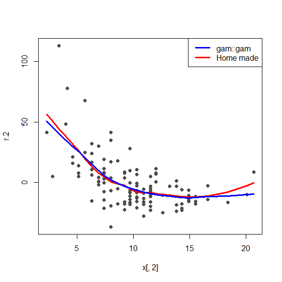
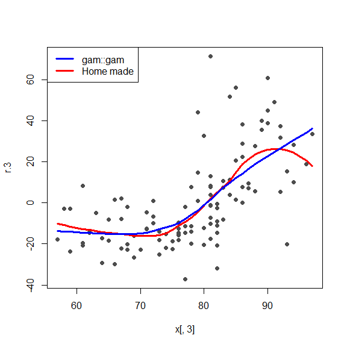

STAT547O - Backfitting notes
================
Matias Salibian-Barrera
2019-11-07

#### LICENSE

These notes are released under the “Creative Commons
Attribution-ShareAlike 4.0 International” license. See the
**human-readable version**
[here](https://creativecommons.org/licenses/by-sa/4.0/) and the **real
thing**
[here](https://creativecommons.org/licenses/by-sa/4.0/legalcode).

# Backfitting (robust and otherwise) “by hand”

We use the Air Quality data. To simplify the example, we will only use
two explanatory variables (`Wind` and `Temp`):

``` r
library(RBF)
data(airquality)
x <- airquality
x <- x[ complete.cases(x), ]
x <- x[, c('Ozone', 'Wind', 'Temp')]
y <- as.vector(x$Ozone)
x <- as.matrix(x[, c('Wind', 'Temp')])
```

A scatter plot of the data

``` r
pairs(cbind(y,x), labels=c('Ozone', colnames(x)), pch=19, col='gray30', cex=1.5)
```

<!-- -->

### Classical backfitting

The algorithm starts with the estimated intercept (equal to the sample
mean of the response), and all the components of the additive model set
to zero:

``` r
alpha.hat <- mean(y)
n <- length(y)
bandw <- 5
f.hat.1 <- f.hat.2 <- rep(0, n)
```

We now compute *partial residuals* without using `f.hat.1`:

``` r
r.1 <- y - alpha.hat - f.hat.2
```

We smooth this vector of residuals as a function of `x1`

``` r
library(KernSmooth)
oo <- order(x[,1])
tmp <- locpoly(x=x[,1], y=r.1, degree=1, bandwidth=bandw)
tmp.f <- approxfun(x=tmp$x, y=tmp$y)
f.hat.1 <- tmp.f(x[,1])
plot(r.1 ~ x[,1], type='p', pch=19, col='gray30')
lines(f.hat.1[oo] ~ x[oo,1], col='red')
```

<!-- -->

Now, compute partial residuals without `f.hat.2` and smooth them as a
function of `x2`,

``` r
oo2 <- order(x[,2])
r.2 <- y - alpha.hat - f.hat.1
tmp2 <- locpoly(x=x[,2], y=r.2, degree=1, bandwidth=bandw)
tmp2.f <- approxfun(x=tmp2$x, y=tmp2$y)
f.hat.2 <- tmp2.f(x[,2])
plot(r.2 ~ x[,2], type='p', pch=19, col='gray30')
lines(f.hat.2[oo2] ~ x[oo2,2], col='red')
```

<!-- --> Iterate

``` r
f.hat.2 <- f.hat.2 - mean(f.hat.2)
f.hat.1 <- f.hat.1 - mean(f.hat.1)
for(i in 1:10) {
  f.hat.1.old <- f.hat.1
  f.hat.2.old <- f.hat.2
  
  r.1 <- y - alpha.hat - f.hat.2
  tmp <- locpoly(x=x[,1], y=r.1, degree=1, bandwidth=bandw)
  tmp.f <- approxfun(x=tmp$x, y=tmp$y)
  f.hat.1 <- tmp.f(x[,1])
  
  r.2 <- y - alpha.hat - f.hat.1
  tmp2 <- locpoly(x=x[,2], y=r.2, degree=1, bandwidth=bandw)
  tmp2.f <- approxfun(x=tmp2$x, y=tmp2$y)
  f.hat.2 <- tmp2.f(x[,2])
  
  f.hat.2 <- f.hat.2 - mean(f.hat.2)
  f.hat.1 <- f.hat.1 - mean(f.hat.1)
  print(mean(f.hat.1-f.hat.1.old)^2 + 
          mean(f.hat.2-f.hat.2.old)^2 )
}
```

    ## [1] 1.69401e-31
    ## [1] 3.831872e-31
    ## [1] 2.310785e-32
    ## [1] 5.866921e-32
    ## [1] 1.621039e-30
    ## [1] 1.141629e-30
    ## [1] 7.763377e-31
    ## [1] 8.50342e-32
    ## [1] 1.319079e-30
    ## [1] 1.038257e-31

``` r
plot(r.1 ~ x[,1], type='p', pch=19, col='gray30')
lines(f.hat.1[oo] ~ x[oo,1], col='red')
```

<!-- -->

``` r
plot(r.2 ~ x[,2], type='p', pch=19, col='gray30')
lines(f.hat.2[oo2] ~ x[oo2,2], col='red')
```

<!-- -->

Sanity check

``` r
library(gam)
dat <- as.data.frame(x)
dat$Ozone <- y
gg <- predict(gam(Ozone ~ lo(Wind, span=.65) + lo(Temp, span=.65), data=dat),
              type='terms')

plot(r.1 ~ x[,1], type='p', pch=19, col='gray30')
lines(f.hat.1[oo] ~ x[oo,1], col='red')
lines(gg[oo,1] ~ x[oo,1], col='blue')
```

<!-- -->

``` r
plot(r.2 ~ x[,2], type='p', pch=19, col='gray30')
lines(f.hat.2[oo2] ~ x[oo2,2], col='red')
lines(gg[oo2,2] ~ x[oo2,2], col='blue')
```

<!-- -->

``` r
head(cbind(f.hat.1, gg[,1]))
```

    ##      f.hat.1           
    ## 1   8.146552   5.476654
    ## 2   5.094942   1.502553
    ## 3 -11.331572 -10.840177
    ## 4  -8.400776  -9.194210
    ## 7   2.272527  -1.211027
    ## 8 -13.963974 -12.148230

``` r
head(cbind(f.hat.2, gg[,2]))
```

    ##     f.hat.2          
    ## 1 -17.22267 -17.63693
    ## 2 -15.03204 -14.31490
    ## 3 -13.00448 -12.53442
    ## 4 -18.31211 -19.33725
    ## 7 -17.64003 -18.31303
    ## 8 -18.93091 -20.39988

``` r
plot(f.hat.1, gg[,1]); abline(0,1)
```

<!-- -->

``` r
plot(f.hat.2, gg[,2]); abline(0,1)
```

<!-- -->
