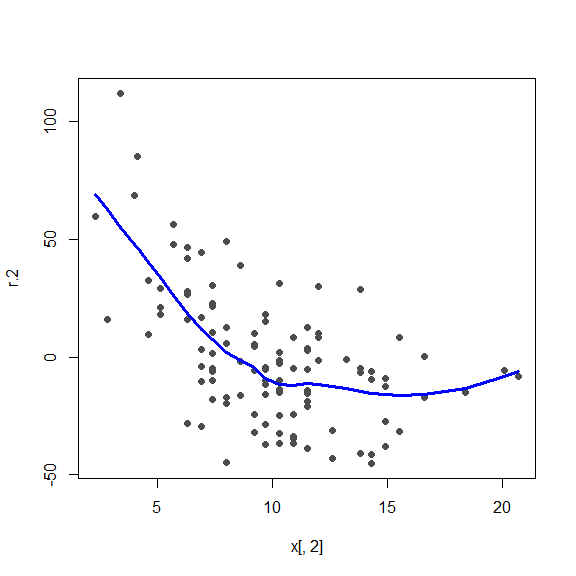
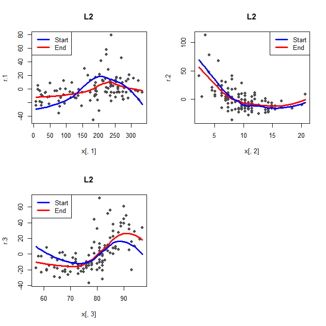
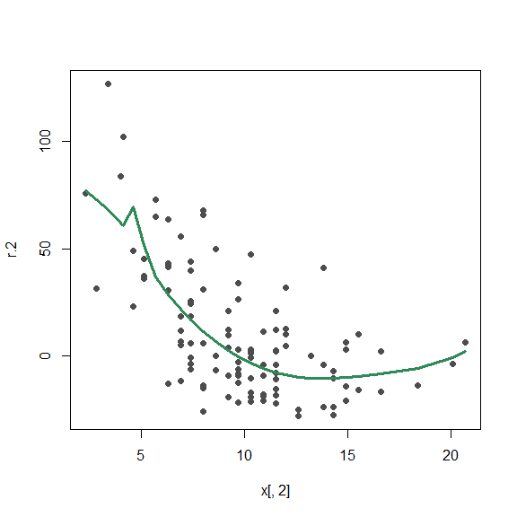
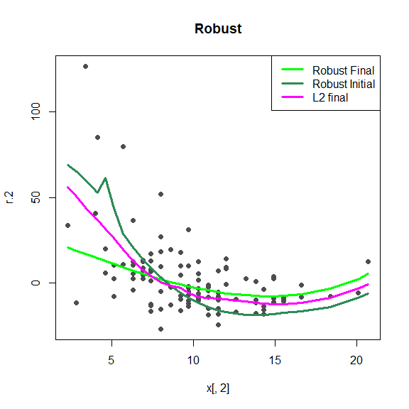

STAT547O - Backfitting notes
================
Matias Salibian-Barrera
2019-11-09

#### LICENSE

These notes are released under the “Creative Commons
Attribution-ShareAlike 4.0 International” license. See the
**human-readable version**
[here](https://creativecommons.org/licenses/by-sa/4.0/) and the **real
thing**
[here](https://creativecommons.org/licenses/by-sa/4.0/legalcode).

# DRAFT (Read at your own risk)

## Backfitting (robust and otherwise) “by hand”

In these notes we apply the backfitting algorithm to estimate the
components of an additive model for the Air Quality Data (available in
`R` in package `datasets`). The goal is to illustrate how backfitting
works, and compare the classical (“L2”) and robust estimators for an
additive model. First we construct the response vector `y` and the
“design matrix” `x` that contains the three available explanatory
variables:

``` r
data(airquality)
x <- airquality
x <- x[ complete.cases(x), ]
x <- x[, c('Ozone', 'Solar.R', 'Wind', 'Temp')]
y <- as.vector(x$Ozone)
x <- as.matrix(x[, c('Solar.R', 'Wind', 'Temp')])
```

We use all the pairwise plots to take a very quick look at the data:

``` r
pairs(cbind(y,x), labels=c('Ozone', colnames(x)), pch=19, col='gray30', cex=1.5)
```

<!-- -->

### Classical backfitting

As we discussed in class, the classical backfitting algorithm is used to
estimate the components of an additive regression model. More
specifically, the algorithm is an iterative procedure to find a solution
to the first-order system of equations. There are two loops: the inner
loop iterates over the components of the additive model, and the outer
loop repeats this until a convergence (or stopping) criterion is
satisfied.

It is easy to see that in the L2 case the estimated intercept is the
mean of the response, so the algorithm starts setting the intercept
estimator equal to the sample mean of the vector of responses. In
addition, all the components of the additive model are initialized at
zero:

``` r
alpha.hat <- mean(y)
n <- length(y)
f.hat.1 <- f.hat.2 <- f.hat.3 <- rep(0, n)
```

To start the first step of the inner loop we compute *partial residuals*
without using `f.hat.1`:

``` r
r.1 <- y - alpha.hat - f.hat.2 - f.hat.3
```

To estimate the function \[\hat{f}_1(a) = E(R_1 | X_1 = a)\] we use a
kernel local regression estimator to smooth the vector of partial
residuals `r.1` above as a function of `x1`. In what follows we will use
the function `loess` to compute a local polynomial regression estimator,
with a bandwidth of `span = .65`. The latter was chosen subjectively
(essentially by “eyeballing” the plots so that they look reasonable). In
practice one would need a principled approach to this
(e.g. cross-validation).

``` r
oo <- order(x[,1])
f.hat.1 <- fitted( loess(r.1 ~ x[,1], span=.65, family='gaussian') ) 
```

We look at the resulting smoother:

``` r
plot(r.1 ~ x[,1], type='p', pch=19, col='gray30')
lines(f.hat.1[oo] ~ x[oo,1], col='blue', lwd=3)
```

<!-- -->

The next step of the inner loop is to compute partial residuals without
`f.hat.2` and smooth them as a function of `x2`. The code below does
this and also displays the resulting estimator of the function
\[\hat{f}_2(a) = E(R_2 | X_2 = a)\]:

``` r
oo2 <- order(x[,2])
r.2 <- y - alpha.hat - f.hat.1 - f.hat.3
f.hat.2 <- fitted( loess(r.2 ~ x[,2], span=.65, family='gaussian') ) 
plot(r.2 ~ x[,2], type='p', pch=19, col='gray30')
lines(f.hat.2[oo2] ~ x[oo2,2], col='blue', lwd=3)
```

<!-- -->

Finally, we repeat the above to compute an estimator for \[\hat{f}_3\]:

``` r
oo3 <- order(x[,3])
r.3 <- y - alpha.hat - f.hat.1 - f.hat.2
f.hat.3 <- fitted( loess(r.3 ~ x[,3], span=.65, family='gaussian') ) 
plot(r.3 ~ x[,3], type='p', pch=19, col='gray30')
lines(f.hat.3[oo3] ~ x[oo3,3], col='blue', lwd=3)
```

<!-- -->

Finally, we center our estimated components of the additive model, since
they are constrained to satisfy \[E(f_j(X_j)) = 0\].

``` r
f.hat.3 <- f.hat.3 - mean(f.hat.3)
f.hat.2 <- f.hat.2 - mean(f.hat.2)
f.hat.1 <- f.hat.1 - mean(f.hat.1)
```

I will also save these 1st-step estimates to compare them with the final
ones below.

``` r
f.hat.1.orig <- f.hat.1
f.hat.2.orig <- f.hat.2
f.hat.3.orig <- f.hat.3
```

We have now completed **one** pass of the inner loop. We now perform 15
iterations of this loop. Why 15? Only because I thought they would be
enough for convergence. Just in case, below we also print the
approximated L2 norm of consecutive estimates, the square root of
\[\sum_{j=1}^3 \| \hat{f}_j^{(k+1)} - \hat{f}_j^{(k)} \|^2\].

``` r
for(i in 1:15) {
  f.hat.1.old <- f.hat.1
  f.hat.2.old <- f.hat.2
  f.hat.3.old <- f.hat.3
  
  r.1 <- y - alpha.hat - f.hat.2 - f.hat.3
  f.hat.1 <- fitted( loess(r.1 ~ x[,1], span=.65, family='gaussian') ) 

  r.2 <- y - alpha.hat - f.hat.1 - f.hat.3
  f.hat.2 <- fitted( loess(r.2 ~ x[,2], span=.65, family='gaussian') ) 

  r.3 <- y - alpha.hat - f.hat.1 - f.hat.2
  f.hat.3 <- fitted( loess(r.3 ~ x[,3], span=.65, family='gaussian') ) 

  f.hat.3 <- f.hat.3 - mean(f.hat.3)
  f.hat.2 <- f.hat.2 - mean(f.hat.2)
  f.hat.1 <- f.hat.1 - mean(f.hat.1)
  
  print(sqrt(mean((f.hat.1-f.hat.1.old)^2) + 
          mean((f.hat.2-f.hat.2.old)^2) +
          mean((f.hat.3-f.hat.3.old)^2)))
}
```

    ## [1] 9.035611
    ## [1] 3.358609
    ## [1] 1.348306
    ## [1] 0.5391672
    ## [1] 0.2063781
    ## [1] 0.07490026
    ## [1] 0.02577467
    ## [1] 0.00841483
    ## [1] 0.002605988
    ## [1] 0.0007670054
    ## [1] 0.0002178617
    ## [1] 6.330929e-05
    ## [1] 2.095538e-05
    ## [1] 8.061999e-06
    ## [1] 3.252211e-06

We see that the algorithm converges rather quickly. Now plot the “final”
estimates, and compare them with the initial ones:

``` r
plot(r.1 ~ x[,1], type='p', pch=19, col='gray30', main='L2')
lines(f.hat.1[oo] ~ x[oo,1], col='red', lwd=3)
lines(f.hat.1.orig[oo] ~ x[oo,1], col='blue', lwd=3)
legend('topleft', legend=c('Start', 'End'), lwd=3, col=c('blue', 'red'))
```

<!-- -->

``` r
plot(r.2 ~ x[,2], type='p', pch=19, col='gray30', main='L2')
lines(f.hat.2[oo2] ~ x[oo2,2], col='red', lwd=3)
lines(f.hat.2.orig[oo2] ~ x[oo2,2], col='blue', lwd=3)
legend('topright', legend=c('Start', 'End'), lwd=3, col=c('blue', 'red'))
```

<!-- -->

``` r
plot(r.3 ~ x[,3], type='p', pch=19, col='gray30', main='L2')
lines(f.hat.3[oo3] ~ x[oo3,3], col='red', lwd=3)
lines(f.hat.3.orig[oo3] ~ x[oo3,3], col='blue', lwd=3)
legend('topleft', legend=c('Start', 'End'), lwd=3, col=c('blue', 'red'))
```

<!-- -->

**NOTE** that the above comparisons between the initial estimators and
the final ones is not completely accurate, as the partial residuals in
each plot (the “dots”) actually depend on the estimated regression
functions.

#### Sanity check

To verify that our code above does in fact produce reasonable results,
we compare our “home made” estimates with those computed with
`gam::gam()` (both graphically and we look at their values). They are of
course not identical, but reassuringly close.

``` r
library(gam)
dat <- as.data.frame(x)
dat$Ozone <- y
gg <- predict(gam(Ozone ~ lo(Solar.R, span=.65) +
                  lo(Wind, span=.65) + lo(Temp, span=.65), data=dat),
              type='terms')

plot(r.1 ~ x[,1], type='p', pch=19, col='gray30')
lines(f.hat.1[oo] ~ x[oo,1], col='red', lwd=3)
lines(gg[oo,1] ~ x[oo,1], col='blue', lwd=3)
legend('topleft', legend=c('gam::gam', 'Home made'), lwd=3, col=c('blue', 'red'))
```

<!-- -->

``` r
plot(r.2 ~ x[,2], type='p', pch=19, col='gray30')
lines(f.hat.2[oo2] ~ x[oo2,2], col='red', lwd=3)
lines(gg[oo2,2] ~ x[oo2,2], col='blue', lwd=3)
legend('topright', legend=c('gam::gam', 'Home made'), lwd=3, col=c('blue', 'red'))
```

<!-- -->

``` r
plot(r.3 ~ x[,3], type='p', pch=19, col='gray30')
lines(f.hat.3[oo3] ~ x[oo3,3], col='red', lwd=3)
lines(gg[oo3,3] ~ x[oo3,3], col='blue', lwd=3)
legend('topleft', legend=c('gam::gam', 'Home made'), lwd=3, col=c('blue', 'red'))
```

<!-- -->

I will also save our “final” estimators to compare them with the robust
ones below:

``` r
f.hat.1.cl <- f.hat.1
f.hat.2.cl <- f.hat.2
f.hat.3.cl <- f.hat.3
```

### Robust BF

We now turn our attention to robust estimators for the components of an
additive model. As we discussed in class, given a loss function `rho` we
need to estimate the functions \[\tilde{f}_j(a)\] that solve
\[E( \rho'((R_j - \hat{f}_j(a))/\sigma) 
| X_j = a) = 0\], which are the first order conditions of the
corresponding “robust” optimization problem. Note that now the intercept
estimator solves \[E( \rho'((R_j - \hat{\alpha}))/\sigma) ) = 0\], and
thus needs to be updated at the end of each iteration of the inner loop
(unlike what happened in the L2 case). Also note that we need an
estimate for `sigma`, the scale of the errors, which will remain fixed
throughout the rest of the computations. We use the function
`RBF::backf.rob` that computes such an estimator using a the residuals
with respect to a local median fit.

``` r
bandw <- c(137, 9, 8)
si.hat <- RBF::backf.rob(Xp=x, yp=y, windows=bandw)$sigma.hat
```

The bandwidths above were originally computed using robust cross
validation and the implementation of this robust backfitting in
`RBF::backf.rob`.

We now need a robust alternative to `loess` (specifically, of `predict(
loess(...) )`). We will write our own function to do this. The following
function `localM` computes a local M-estimator of regression, using a
polynomial of 2nd degree. Formally, given:

  - the data (in the vectors `x` and `y`);
  - the bandwidth `h`;
  - the point `x0` at which we want to compute \[\hat{f}(x_0)\];
  - an estimate of the residual scale `sigma`; and
  - the choice of tuning parameters for `rho` (in this case we use
    Tukey’s bisquare function),

the function `localM` computes the solution `a` to

    mean( \rhoprime( (y-a)/sigma), cc=cc) * kernel((x-x_0)/h) = 0

By default, `cc` is chosen to achieve 95% asymptotic efficiency for
linear regression models with Gaussian errors.

Our function `localM` also accepts two additional parameters (`tol` and
`max.it`) to control the convergence of the weighted least squares
iterations. The algorithm is initialized using a (kernel) weighted
(“local”) L1 estimator of regression (also using a 2nd degree
polynomial).

``` r
localM <- function(x0, x, y, sigma, 
                   cc=RobStatTM::lmrobdet.control(family='bisquare',
                                                  efficiency=.95)$tuning.psi, 
                   h, tol=1e-5, max.it=100) {
  ker.we <- RBF::k.epan((x - x0)/h)
  beta <- coef( quantreg::rq(y ~ I(x-x0) + I((x-x0)^2), weights=ker.we))
  n <- length(y)
  zz <- cbind(rep(1,n), x - x0, (x-x0)^2)
  err <- 10*tol
  j <- 0
  while( (err > tol) & (j < max.it) ) {
    beta.old <- beta
    re <- as.vector(y - zz %*% beta)
    ww1 <- RobStatTM::rhoprime(re/sigma, family='bisquare', cc=cc) / (re/sigma)
    ww1[ is.nan(ww1) ] <- 1
    ww <- ker.we * ww1
    beta <- solve( t(zz) %*% (zz*ww), t(zz * ww) %*% y) 
    err <- sqrt( sum( (beta - beta.old)^2 ) )
    j <- j + 1
  }
  return(beta[1])
}
```

Using this function, we run the first step of the backfitting algorithm,
exactly as before, but replacing `predict(loess(...))` with
`localM(...)`. Note, however, that in this case we need to loop through
the values of each explanatory variable in the training set (`loess`
does this internally when we call `predict`). In fact, the function
`RBF::backf.rob` does this, but the objective of these notes is to do it
“by hand”.

Here is the first pass of the inner loop. The additive model components
are initialized at zero, and the intercept is estimated using the
function `RobStaTM::locScaleM` which computes an M-estimator of
location. **Note** that this is in fact only an approximation to what we
need, since `locScaleM` computes its own residual scale estimator.
Although it would be more appropriate to write our own function to
compute our intercept estimator, this is not really the objective of
these notes. In fact, we leave this task to the reader as a very good
exercise.

``` r
alpha.hat <- RobStatTM::locScaleM(x=y, psi='bisquare')$mu
n <- length(y)
f.hat.1 <- f.hat.2 <- f.hat.3 <- rep(0, n)

r.1 <- y - alpha.hat - f.hat.2 - f.hat.3
oo <- order(x[,1])
for(i in 1:n) 
  f.hat.1[i] <- localM(x0=x[i,1], x=x[,1], y=r.1, sigma=si.hat, h=bandw[1])

plot(r.1 ~ x[,1], type='p', pch=19, col='gray30')
lines(f.hat.1[oo] ~ x[oo,1], col='seagreen', lwd=3)
```

<!-- -->

``` r
oo2 <- order(x[,2])
r.2 <- y - alpha.hat - f.hat.1 - f.hat.3
for(i in 1:n) 
  f.hat.2[i] <- localM(x0=x[i,2], x=x[,2], y=r.2, sigma=si.hat, h=bandw[2])

plot(r.2 ~ x[,2], type='p', pch=19, col='gray30')
lines(f.hat.2[oo2] ~ x[oo2,2], col='seagreen', lwd=3)
```

<!-- -->

``` r
oo3 <- order(x[,3])
r.3 <- y - alpha.hat - f.hat.1 - f.hat.2
for(i in 1:n) 
  f.hat.3[i] <- localM(x0=x[i,3], x=x[,3], y=r.3, sigma=si.hat, h=bandw[3])
plot(r.3 ~ x[,3], type='p', pch=19, col='gray30')
lines(f.hat.3[oo3] ~ x[oo3,3], col='seagreen', lwd=3)
```

<!-- -->

As before, we center the estimated components of the model, and now also
update the intercept estimator (we also save this *1st step* estimator
for later):

``` r
f.hat.3 <- f.hat.3 - mean(f.hat.3)
f.hat.2 <- f.hat.2 - mean(f.hat.2)
f.hat.1 <- f.hat.1 - mean(f.hat.1)
alpha.hat <- RobStatTM::locScaleM(x=y - f.hat.1 - f.hat.2 - f.hat.3,
                                  psi='bisquare')$mu
f.hat.1.orig <- f.hat.1
f.hat.2.orig <- f.hat.2
f.hat.3.orig <- f.hat.3
```

We use 15 iterations and display a possible convergence criterion to
monitor the iterations:

``` r
for(i in 1:15) {
  f.hat.1.old <- f.hat.1
  f.hat.2.old <- f.hat.2
  f.hat.3.old <- f.hat.3
  
  r.1 <- y - alpha.hat - f.hat.2 - f.hat.3
  for(i in 1:n) 
    f.hat.1[i] <- localM(x0=x[i,1], x=x[,1], y=r.1, sigma=si.hat, h=bandw[1])
  
  r.2 <- y - alpha.hat - f.hat.1 - f.hat.3
  for(i in 1:n) 
    f.hat.2[i] <- localM(x0=x[i,2], x=x[,2], y=r.2, sigma=si.hat, h=bandw[2])
  
  r.3 <- y - alpha.hat - f.hat.1 - f.hat.2
  for(i in 1:n) 
    f.hat.3[i] <- localM(x0=x[i,3], x=x[,3], y=r.3, sigma=si.hat, h=bandw[3])
  
  f.hat.3 <- f.hat.3 - mean(f.hat.3)
  f.hat.2 <- f.hat.2 - mean(f.hat.2)
  f.hat.1 <- f.hat.1 - mean(f.hat.1)
  
  alpha.hat <- RobStatTM::locScaleM(x=y - f.hat.1 - f.hat.2 - f.hat.3,
                                  psi='bisquare')$mu
  
  print(sqrt(mean((f.hat.1-f.hat.1.old)^2) + 
               mean((f.hat.2-f.hat.2.old)^2) +
               mean((f.hat.3-f.hat.3.old)^2)))
}
```

    ## [1] 11.47662
    ## [1] 4.37787
    ## [1] 2.005267
    ## [1] 0.8529219
    ## [1] 0.3440702
    ## [1] 0.1327956
    ## [1] 0.049089
    ## [1] 0.01736437
    ## [1] 0.005869899
    ## [1] 0.001895617
    ## [1] 0.0005904411
    ## [1] 0.0001858448
    ## [1] 6.586016e-05
    ## [1] 2.773819e-05
    ## [1] 1.26106e-05

We now look at the robust estimators:

``` r
plot(r.1 ~ x[,1], type='p', pch=19, col='gray30', main='Robust')
lines(f.hat.1[oo] ~ x[oo,1], col='green', lwd=3)
lines(f.hat.1.orig[oo] ~ x[oo,1], col='seagreen', lwd=3)
lines(f.hat.1.cl[oo] ~ x[oo,1], col='magenta', lwd=3)
legend('topleft', legend=c('Robust Final', 'Robust Initial', 'L2 final'), 
       lwd=3, col=c('green', 'seagreen', 'magenta'))
```

<!-- -->

``` r
plot(r.2 ~ x[,2], type='p', pch=19, col='gray30', main='Robust')
lines(f.hat.2[oo2] ~ x[oo2,2], col='green', lwd=3)
lines(f.hat.2.orig[oo2] ~ x[oo2,2], col='seagreen', lwd=3)
lines(f.hat.2.cl[oo2] ~ x[oo2,2], col='magenta', lwd=3)
legend('topright', legend=c('Robust Final', 'Robust Initial', 'L2 final'), 
       lwd=3, col=c('green', 'seagreen', 'magenta'))
```

<!-- -->

``` r
plot(r.3 ~ x[,3], type='p', pch=19, col='gray30', main='Robust')
lines(f.hat.3[oo3] ~ x[oo3,3], col='green', lwd=3)
lines(f.hat.3.orig[oo3] ~ x[oo3,3], col='seagreen', lwd=3)
lines(f.hat.3.cl[oo3] ~ x[oo3,3], col='magenta', lwd=3)
legend('topleft', legend=c('Robust Final', 'Robust Initial', 'L2 final'), 
       lwd=3, col=c('green', 'seagreen', 'magenta'))
```

<!-- -->

**NOTE** that the above comparisons between the two estimators should be
used only as an approximation, as the partial residuals in each plot
(the “dots”) actually depend on the estimated regression functions.

#### Which one is “right” or “better”?

Suggestion: compare predictions\!
