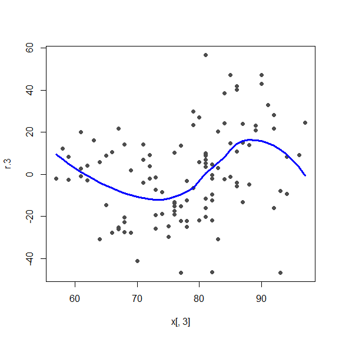
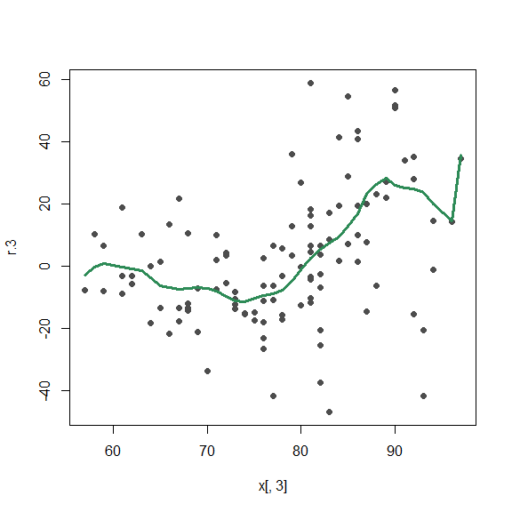
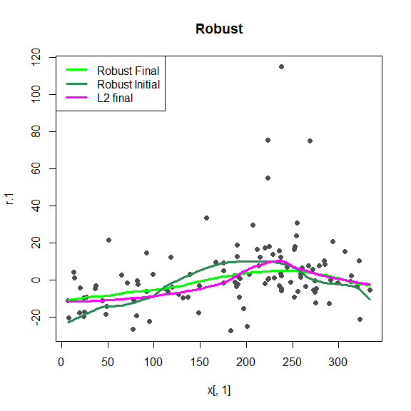

STAT547O - Backfitting notes
================
Matias Salibian-Barrera
2019-11-08

#### LICENSE

These notes are released under the “Creative Commons
Attribution-ShareAlike 4.0 International” license. See the
**human-readable version**
[here](https://creativecommons.org/licenses/by-sa/4.0/) and the **real
thing**
[here](https://creativecommons.org/licenses/by-sa/4.0/legalcode).

# DRAFT (Read at your own risk)

## Backfitting (robust and otherwise) “by hand”

We use the Air Quality data. To simplify the example, we will only use
two explanatory variables (`Wind` and `Temp`):

``` r
library(RBF)
data(airquality)
x <- airquality
x <- x[ complete.cases(x), ]
x <- x[, c('Ozone', 'Solar.R', 'Wind', 'Temp')]
y <- as.vector(x$Ozone)
x <- as.matrix(x[, c('Solar.R', 'Wind', 'Temp')])
```

A scatter plot of the data

``` r
pairs(cbind(y,x), labels=c('Ozone', colnames(x)), pch=19, col='gray30', cex=1.5)
```

<!-- -->

### Classical backfitting

The algorithm starts with the estimated intercept (equal to the sample
mean of the response), and all the components of the additive model set
to zero:

``` r
alpha.hat <- mean(y)
n <- length(y)
bandw <- 5
f.hat.1 <- f.hat.2 <- f.hat.3 <- rep(0, n)
```

We now compute *partial residuals* without using `f.hat.1`:

``` r
r.1 <- y - alpha.hat - f.hat.2 - f.hat.3
```

We smooth this vector of residuals as a function of `x1`

``` r
oo <- order(x[,1])
f.hat.1 <- fitted( loess(r.1 ~ x[,1], span=.65, family='gaussian') ) 
plot(r.1 ~ x[,1], type='p', pch=19, col='gray30')
lines(f.hat.1[oo] ~ x[oo,1], col='red')
```

<!-- -->

Now, compute partial residuals without `f.hat.2` and smooth them as a
function of `x2`,

``` r
oo2 <- order(x[,2])
r.2 <- y - alpha.hat - f.hat.1 - f.hat.3
f.hat.2 <- fitted( loess(r.2 ~ x[,2], span=.65, family='gaussian') ) 
plot(r.2 ~ x[,2], type='p', pch=19, col='gray30')
lines(f.hat.2[oo2] ~ x[oo2,2], col='red')
```

<!-- -->

Finally, update `f.hat.3`:

``` r
oo3 <- order(x[,3])
r.3 <- y - alpha.hat - f.hat.1 - f.hat.2
f.hat.3 <- fitted( loess(r.3 ~ x[,3], span=.65, family='gaussian') ) 
plot(r.3 ~ x[,3], type='p', pch=19, col='gray30')
lines(f.hat.3[oo3] ~ x[oo3,3], col='red')
```

<!-- -->

Iterate

``` r
f.hat.3 <- f.hat.3 - mean(f.hat.3)
f.hat.2 <- f.hat.2 - mean(f.hat.2)
f.hat.1 <- f.hat.1 - mean(f.hat.1)
f.hat.1.orig <- f.hat.1
f.hat.2.orig <- f.hat.2
f.hat.3.orig <- f.hat.3

for(i in 1:15) {
  f.hat.1.old <- f.hat.1
  f.hat.2.old <- f.hat.2
  f.hat.3.old <- f.hat.3
  
  r.1 <- y - alpha.hat - f.hat.2 - f.hat.3
  f.hat.1 <- fitted( loess(r.1 ~ x[,1], span=.65, family='gaussian') ) 

  r.2 <- y - alpha.hat - f.hat.1 - f.hat.3
  f.hat.2 <- fitted( loess(r.2 ~ x[,2], span=.65, family='gaussian') ) 

  r.3 <- y - alpha.hat - f.hat.1 - f.hat.2
  f.hat.3 <- fitted( loess(r.3 ~ x[,3], span=.65, family='gaussian') ) 

  f.hat.3 <- f.hat.3 - mean(f.hat.3)
  f.hat.2 <- f.hat.2 - mean(f.hat.2)
  f.hat.1 <- f.hat.1 - mean(f.hat.1)
  
  print(sqrt(mean((f.hat.1-f.hat.1.old)^2) + 
          mean((f.hat.2-f.hat.2.old)^2) +
          mean((f.hat.3-f.hat.3.old)^2)))
}
```

    ## [1] 9.035611
    ## [1] 3.358609
    ## [1] 1.348306
    ## [1] 0.5391672
    ## [1] 0.2063781
    ## [1] 0.07490026
    ## [1] 0.02577467
    ## [1] 0.00841483
    ## [1] 0.002605988
    ## [1] 0.0007670054
    ## [1] 0.0002178617
    ## [1] 6.330929e-05
    ## [1] 2.095538e-05
    ## [1] 8.061999e-06
    ## [1] 3.252211e-06

``` r
plot(r.1 ~ x[,1], type='p', pch=19, col='gray30')
lines(f.hat.1[oo] ~ x[oo,1], col='red')
lines(f.hat.1.orig[oo] ~ x[oo,1], col='blue')
```

<!-- -->

``` r
plot(r.2 ~ x[,2], type='p', pch=19, col='gray30')
lines(f.hat.2[oo2] ~ x[oo2,2], col='red')
lines(f.hat.2.orig[oo2] ~ x[oo2,2], col='blue')
```

<!-- -->

``` r
plot(r.3 ~ x[,3], type='p', pch=19, col='gray30')
lines(f.hat.3[oo3] ~ x[oo3,3], col='red')
lines(f.hat.3.orig[oo3] ~ x[oo3,3], col='blue')
```

<!-- -->

#### Sanity check

``` r
library(gam)
dat <- as.data.frame(x)
dat$Ozone <- y
gg <- predict(gam(Ozone ~ lo(Solar.R, span=.65) +
                  lo(Wind, span=.65) + lo(Temp, span=.65), data=dat),
              type='terms')

plot(r.1 ~ x[,1], type='p', pch=19, col='gray30')
lines(f.hat.1[oo] ~ x[oo,1], col='red')
lines(gg[oo,1] ~ x[oo,1], col='blue')
```

<!-- -->

``` r
plot(r.2 ~ x[,2], type='p', pch=19, col='gray30')
lines(f.hat.2[oo2] ~ x[oo2,2], col='red')
lines(gg[oo2,2] ~ x[oo2,2], col='blue')
```

<!-- -->

``` r
plot(r.3 ~ x[,3], type='p', pch=19, col='gray30')
lines(f.hat.3[oo3] ~ x[oo3,3], col='red')
lines(gg[oo3,3] ~ x[oo3,3], col='blue')
```

<!-- -->

``` r
f.hat.1.cl <- f.hat.1
f.hat.2.cl <- f.hat.2
f.hat.3.cl <- f.hat.3

# head(cbind(f.hat.1, gg[,1]))
# head(cbind(f.hat.2, gg[,2]))
# head(cbind(f.hat.3, gg[,3]))
# 
# plot(f.hat.1, gg[,1]); abline(0,1)
# plot(f.hat.2, gg[,2]); abline(0,1)
# plot(f.hat.3, gg[,3]); abline(0,1)
```

### Robust BF

For the robust one. Estimate sigma first (and keep it fixed)

``` r
library(RBF)
bandw <- c(137, 9, 8)
si.hat <- backf.rob(Xp=x, yp=y, windows=bandw)$sigma.hat
```

  - Need a function f(x\_0, x, y, sigma, cc, h) that returns the
    solution `a` to

<!-- end list -->

``` r
# mean( \rhoprime( (y-a)/sigma), cc=cc) * kernel((x-x_0)/h) = 0
localM <- function(x0, x, y, sigma, 
                   cc=RobStatTM::lmrobdet.control(family='bisquare',
                                                         bb=.5)$tuning.psi, 
                   h, tol=1e-5, max.it=100) {
  ker.we <- RBF::k.epan((x - x0)/h)
  ii <- which( abs(x-x0) < h) 
  a0 <- median(y[ii])
  beta <- coef( quantreg::rq(y ~ I(x-x0) + I((x-x0)^2), subset=ii) )
  n <- length(y)
  zz <- cbind(rep(1,n), x - x0, (x-x0)^2)
  err <- 10*tol
  j <- 0
  while( (err > tol) & (j < max.it) ) {
    beta.old <- beta
    re <- as.vector(y - zz %*% beta)
    ww1 <- RobStatTM::rhoprime(re/sigma, family='bisquare', cc=cc) / (re/sigma)
    ww1[ is.nan(ww1) ] <- 1
    ww <- ker.we * ww1
    beta <- solve( t(zz) %*% (zz*ww), t(zz * ww) %*% y) 
    err <- sqrt( sum( (beta - beta.old)^2 ) )
    j <- j + 1
  }
  return(beta[1])
}
```

``` r
alpha.hat <- RobStatTM::locScaleM(x=y, psi='bisquare')$mu
n <- length(y)
f.hat.1 <- f.hat.2 <- f.hat.3 <- rep(0, n)

r.1 <- y - alpha.hat - f.hat.2 - f.hat.3
oo <- order(x[,1])
for(i in 1:n) 
  f.hat.1[i] <- localM(x0=x[i,1], x=x[,1], y=r.1, sigma=si.hat, h=bandw[1])

plot(r.1 ~ x[,1], type='p', pch=19, col='gray30')
lines(f.hat.1[oo] ~ x[oo,1], col='red')
```

<!-- -->

``` r
oo2 <- order(x[,2])
r.2 <- y - alpha.hat - f.hat.1 - f.hat.3
for(i in 1:n) 
  f.hat.2[i] <- localM(x0=x[i,2], x=x[,2], y=r.2, sigma=si.hat, h=bandw[2])

plot(r.2 ~ x[,2], type='p', pch=19, col='gray30')
lines(f.hat.2[oo2] ~ x[oo2,2], col='red')
```

<!-- -->

``` r
oo3 <- order(x[,3])
r.3 <- y - alpha.hat - f.hat.1 - f.hat.2
for(i in 1:n) 
  f.hat.3[i] <- localM(x0=x[i,3], x=x[,3], y=r.3, sigma=si.hat, h=bandw[3])
plot(r.3 ~ x[,3], type='p', pch=19, col='gray30')
lines(f.hat.3[oo3] ~ x[oo3,3], col='red')
```

<!-- -->

Robust iterations

``` r
f.hat.3 <- f.hat.3 - mean(f.hat.3)
f.hat.2 <- f.hat.2 - mean(f.hat.2)
f.hat.1 <- f.hat.1 - mean(f.hat.1)
alpha.hat <- RobStatTM::locScaleM(x=y - f.hat.1 - f.hat.2 - f.hat.3,
                                  psi='bisquare')$mu
f.hat.1.orig <- f.hat.1
f.hat.2.orig <- f.hat.2
f.hat.3.orig <- f.hat.3

for(i in 1:15) {
  f.hat.1.old <- f.hat.1
  f.hat.2.old <- f.hat.2
  f.hat.3.old <- f.hat.3
  
  r.1 <- y - alpha.hat - f.hat.2 - f.hat.3
  for(i in 1:n) 
    f.hat.1[i] <- localM(x0=x[i,1], x=x[,1], y=r.1, sigma=si.hat, h=bandw[1])
  
  r.2 <- y - alpha.hat - f.hat.1 - f.hat.3
  for(i in 1:n) 
    f.hat.2[i] <- localM(x0=x[i,2], x=x[,2], y=r.2, sigma=si.hat, h=bandw[2])
  
  r.3 <- y - alpha.hat - f.hat.1 - f.hat.2
  for(i in 1:n) 
    f.hat.3[i] <- localM(x0=x[i,3], x=x[,3], y=r.3, sigma=si.hat, h=bandw[3])
  
  f.hat.3 <- f.hat.3 - mean(f.hat.3)
  f.hat.2 <- f.hat.2 - mean(f.hat.2)
  f.hat.1 <- f.hat.1 - mean(f.hat.1)
  
  alpha.hat <- RobStatTM::locScaleM(x=y - f.hat.1 - f.hat.2 - f.hat.3,
                                  psi='bisquare')$mu
  
  print(sqrt(mean((f.hat.1-f.hat.1.old)^2) + 
               mean((f.hat.2-f.hat.2.old)^2) +
               mean((f.hat.3-f.hat.3.old)^2)))
}
```

    ## [1] 11.47695
    ## [1] 4.377791
    ## [1] 2.005231
    ## [1] 0.8529065
    ## [1] 0.3440642
    ## [1] 0.1327937
    ## [1] 0.04908799
    ## [1] 0.0173641
    ## [1] 0.005869713
    ## [1] 0.001895551
    ## [1] 0.0005904193
    ## [1] 0.0001858384
    ## [1] 6.585863e-05
    ## [1] 2.773783e-05
    ## [1] 1.261046e-05

Show

``` r
plot(r.1 ~ x[,1], type='p', pch=19, col='gray30')
lines(f.hat.1[oo] ~ x[oo,1], col='red')
lines(f.hat.1.orig[oo] ~ x[oo,1], col='blue')
lines(f.hat.1.cl[oo] ~ x[oo,1], col='magenta')
```

<!-- -->

``` r
plot(r.2 ~ x[,2], type='p', pch=19, col='gray30')
lines(f.hat.2[oo2] ~ x[oo2,2], col='red')
lines(f.hat.2.orig[oo2] ~ x[oo2,2], col='blue')
lines(f.hat.2.cl[oo2] ~ x[oo2,2], col='magenta')
```

<!-- -->

``` r
plot(r.3 ~ x[,3], type='p', pch=19, col='gray30')
lines(f.hat.3[oo3] ~ x[oo3,3], col='red')
lines(f.hat.3.orig[oo3] ~ x[oo3,3], col='blue')
lines(f.hat.3.cl[oo3] ~ x[oo3,3], col='magenta')
```

<!-- -->
