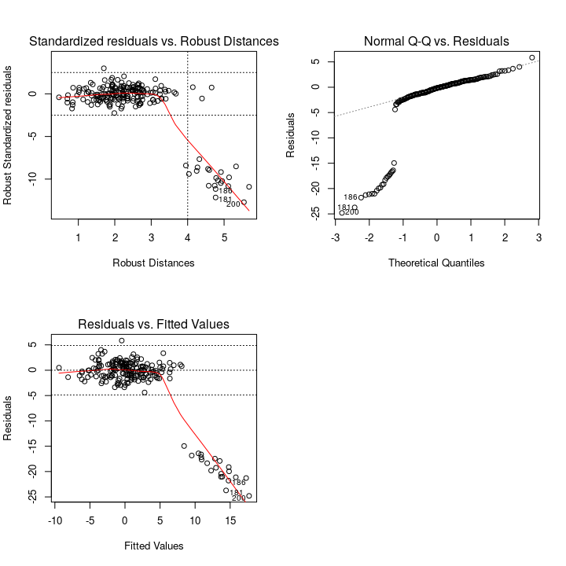
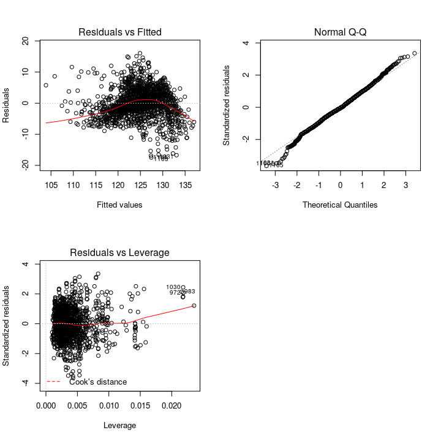
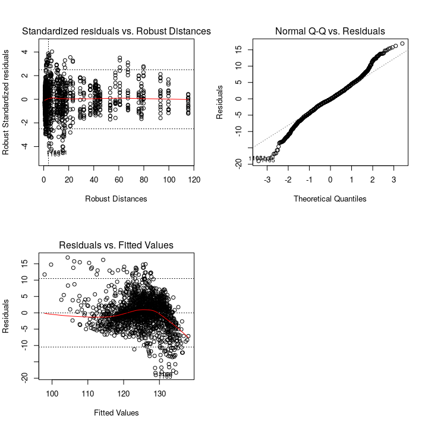

STAT547O - Lecture 1 notes
================
Matias Salibian-Barrera
2019-10-23

#### LICENSE

These notes are released under the "Creative Commons Attribution-ShareAlike 4.0 International" license. See the **human-readable version** [here](https://creativecommons.org/licenses/by-sa/4.0/) and the **real thing** [here](https://creativecommons.org/licenses/by-sa/4.0/legalcode).

Introduction, goals, general setting
====================================

Traditionally (i.e. 60 or 70 years ago), statistical analyses (Data Science analyses? Learning methods?) started with a question of interest (e.g. is this fertilizer better than that one? does this drug reduce cholesterol levels?), and then data was collected, typically via an experiment (under somewhat controlled circumstances). More recently, however, the analyses often start from an existing data set. When Statistics (Data Science? Learning?) is involved, it is generally believed that there exists an unknown stochastic phenomenon that generated the data. A model for this process is postulated, which often (but not always) depends on a set of parameters. Queries about the model (including interpreting its components) are typically phrased in terms of questions about the parameters, and these are answered based on estimated values for them (think of confidence intervals, point estimators, etc.) When the interest is in constructing a predictor, the parameters have no interest in themselves, but they still need to be estimated in order to use the model with future data.

Estimation methods are generally not unique. Historically they have been chosen based on their performance (e.g. properties of the resulting estimators). Common criteria include accuracy (e.g. MSE) and prediction power (e.g. MSPE). These criteria need themselves to be estimated, or computed, which requires making assumptions (e.g. that the data follow a certain family of distributions, that the model is a "good enough" approximation to the stochastic phenomenon generating the data, etc.)

Once sufficient assumptions have been made, "optimal" estimation method can be derived. The most famous example is the large class of Maximum Likelihood Estimators.

**Question**: to what extent do these optimal method remain "good enough" if the assumptions are relaxed? **Answer**: none—they usually fail badly very quickly.

**Question**: can we find estimation methods that remain "good enough" under weaker assumptions (a wider range of possibilities) for the stochastic phenomenon generating the data? **Answer**: Yes. This is what we do in Robust Statistics.

In this course, "weaker assumptions" will mean relaxing the assumptions on the distribution of the data, but we will still rely on the model being a "good enough" approximation. In this sense, this course is about *Robust Statistics Given A Model*.

One useful relaxation in practice is accepting that the data may not be *homogeneous*, i.e. that there may be either errors or points that follow a different process. Other possible departures from the assumptions accompanying the model is that the distributions may belong to a similar family (e.g. that the data follow an elliptical distribution instead of being Gaussian). Here we will mostly consider the former kind of departures, which have been called "gross error" model violations.

In this short course we are interested in the problem of performing statistical analysis when the data may contain atypical observations. These atypical points may be "errors" (due to recording mistakes, equipment malfunction, etc.) or may be due to the presence of observations that follow a different stochastic phenomenon from the one generating the majority of the data. Generally our interest is the latter. Detecting (accurately identifying) potential "outliers" in the training set is also a common goal of Robust Statistics. Finally, we will also consider the problem of obtaining reliable predictions on future ("good") data when the training set may have atypical points.

A very personal "agenda" for this course
----------------------------------------

Rather than attempting a thorough, deep and exhaustive discussion of (necessarily) robust methods for a few simple models, in this notes I will try to illustrate the main current ideas and approaches as applied to models beyond univariate or multivariate location/scale and linear regression models.

For a detailed treatment of the basic concepts and techniques in Robust Statistics for the last 60 years, please refer to the following books:

> Hampel, F. R., Ronchetti, E. M., Rousseeuw, P. J., Stahel, W. A., & Wiley Online Library. (2011;2005;). Robust statistics: The approach based on influence functions. Hoboken: Wiley. [UBC Library link](http://tinyurl.com/y2bnnzss)

> Huber, P. J., Ronchetti, E., & Wiley Online Library. (2009). Robust statistics (2nd;2. Aufl.; ed.). Hoboken, N.J: Wiley. [UBC Library link](http://tinyurl.com/yxpyrsqq)

> Maronna, R. A., Martin, R.D., Yohai, V.J. and Salibian-Barrera, M. Wiley Online Library. (2019). Robust statistics: Theory and methods (with R) (Second;2; ed.). Hoboken, NJ: WIley. <doi:10.1002/9781119214656> [UBC Library link](http://tinyurl.com/yy4heaad)

Two simple linear regression examples
-------------------------------------

We first start with a simple synthetic example, where we know the "truth", to illustrate the different robustness properties of some well-known estimators (LS, L1 (aka quantile regression), M and MM). We will then use a popular real example to compare the performance of a robust estimator with that of the classical least squares in terms of their prediction accuracy.

#### A synthetic toy example (diagnostics and estimation)

This example will show that

-   Outliers can be severerly damaging without being "obviously" deviating;
-   Quantile (L1) regression estimators offer limited protection against atypical observations;
-   Classical diagnostic tools may not work as advertised.

Our example contains
*n* = 200
 observations with
*p* = 6
 explanatory variables. The regression model is
*Y* = *V*1 + 2 \* *V*2 + *V*3 + *V*4 + *V*5 + *ε*
, where
*ε*
 follows a
*N*(0, 1.7)
 distribution. Hence, the true vector of regression coefficients is `(1, 2, 1, 1, 1, 0)` and the true intercept is zero. The explanatory variables are all independent standard normal random variables. I used the following code to generate the data

``` r
n <- 200
p <- 6
set.seed(123)
x0 <- as.data.frame(matrix(rnorm(n*p), n, p))
x0$y <- with(x0, V1 + 2*V2 + V3 + V4 + V5 + rnorm(n, sd=1.7))
```

We now replace the last 20 observations with outliers (for a total proportion of atypical observations of 20/200 = 10%).

``` r
eps <- .1
n1 <- ceiling(n*(1-eps))
x0[n1:n, 1:p] <- matrix(rnorm((n-n1+1)*p, mean=+1.85, sd=.8))
x0$y[n1:n] <- rnorm(n-n1+1, mean=-7, sd=1.7)
```

These atypical observations cannot be seen easily in a pairwise plot, specially if one does not know in advance that they are present:

``` r
pairs(x0)
```


Standard diagnostic plots do not flag anything of importance either:

``` r
m0 <- lm(y~., data=x0)
par(mfrow=c(2,2))
plot(m0, which=1)
plot(m0, which=2)
plot(m0, which=5)
par(mfrow=c(1,1))
```


Note that all the Cook distances are below 0.15, for example. However, the estimated regression coefficients are very different from the true ones (1, 2, 1, 1, 1, 0)

``` r
c(LS=coef(m0), Truth=c(0,1, 2, 1, 1, 1, 0))
```

    ## LS.(Intercept)          LS.V1          LS.V2          LS.V3          LS.V4 
    ##    -0.44554207    -0.51498293     1.05890198    -0.25125929     0.06335662 
    ##          LS.V5          LS.V6         Truth1         Truth2         Truth3 
    ##     0.07413599    -0.77788104     0.00000000     1.00000000     2.00000000 
    ##         Truth4         Truth5         Truth6         Truth7 
    ##     1.00000000     1.00000000     1.00000000     0.00000000

We now compare the estimated regression coefficients obtained with 3 other methods: a redescending-M estimator, an MM-estimator, and the L1-estimator (which is a quantile regression estimator). We will later see in the course that these estimators have different robustness properties.

``` r
library(RobStatTM)
myc <- lmrobdet.control(family='bisquare', efficiency=.85)
m1 <- lmrobdetMM(y~., data=x0, control=myc)
m2 <- lmrobM(y~., data=x0, control=myc)
m3 <- quantreg::rq(y~., data=x0)
cbind(Truth=c(0, 1, 2, 1, 1, 1, 0),
      LS=coef(m0), MM=coef(m1), M=coef(m2), L1=coef(m3))
```

    ##             Truth          LS         MM          M           L1
    ## (Intercept)     0 -0.44554207 -0.1517327 -0.1348886  0.050557638
    ## V1              1 -0.51498293  0.9173941  0.9239679 -0.008095437
    ## V2              2  1.05890198  2.2397068  2.2428899  1.291600765
    ## V3              1 -0.25125929  1.0844115  1.0601163  0.305027876
    ## V4              1  0.06335662  1.0856345  1.0664708  0.396052030
    ## V5              1  0.07413599  1.2830538  1.2561271  0.445126101
    ## V6              0 -0.77788104  0.3272069  0.3180290 -0.585828949

We can also compare the diagnostic plots obtained with the robust estimator, where the outliers are clearly visible.

``` r
par(mfrow=c(2,2))
plot(m1, which=1)
plot(m1, which=2)
plot(m1, which=4)
par(mfrow=c(1,1))
```



#### The Airfoil Self-Noise Data Set (prediction)

The Airfoil Self-Noise Data Set is available at [the UCI repository](https://archive.ics.uci.edu/ml/datasets/Airfoil+Self-Noise). There are
*n* = 1503
 observations and
*p* = 5
 explanatory variables. The response is `Pressure`. A classical fit for a linear regression model does not suggest any immediate problem.

``` r
x <- read.table('airfoil_self_noise.dat', sep='\t', header=TRUE)
m0 <- lm(Pressure ~ . , data=x)
par(mfrow=c(2,2))
plot(m0, which=1)
plot(m0, which=2)
plot(m0, which=5)
par(mfrow=c(1,1))
```



Interestingly, a robust fit produces similar diagnostic outputs

``` r
myc <- lmrobdet.control(family='bisquare', efficiency=.85)
m1 <- lmrobdetMM(Pressure ~ ., data = x, control=myc)
par(mfrow=c(2,2))
plot(m1, which=1)
plot(m1, which=2)
plot(m1, which=4)
par(mfrow=c(1,1))
```



Although most of the estimated regression coefficients computed with LS and with a robust MM estimator are similar, the coefficient for `Displ` seems to be different.

``` r
round(cbind(LS=coef(m0), MM=coef(m1)), 3)
```

    ##                   LS       MM
    ## (Intercept)  132.834  134.402
    ## Freq          -0.001   -0.002
    ## Angle         -0.422   -0.357
    ## Length       -35.688  -37.711
    ## Vel            0.100    0.099
    ## Displ       -147.301 -206.438

Since we don't know the "true" regression parameter in this case, we cannot argue that either of the estimators is
"right" or "wrong". However we can estimate the mean squared prediction error (MSPE) of each estimator, using K-fold cross-validation. We use 100 runs of 5-fold cross-validation. Since in the K-fold iterations outliers may be present both in the training and the test sets, we will look at the mean squared prediction error of the 95% smallest residuals for each estimator. In other words, we will take the average of the squared prediction errors after removing the 5% largest of them (in absolute value). We use the following function to compute the `alpha-trimmed` mean of squared prediction errors:

``` r
tmspe <- function(e, alpha=.1) {
  n <- length(e)
  se <- sort(abs(e))[1:floor(n*(1-alpha))]
  return(mean(se^2))
}
```

We now use 100 runs of 5-fold CV to compare the 5%-trimmed mean of squared prediction errors. The boxplots for the 100 estimated prediction errors associated with the LS and the MM estimators are below. Note that these are estimates of prediction errors when applied to non-atypical observations. We are generally interested in predicting well observations coming from the population of interest, and not the unusual (outlying) ones.

``` r
myc <- lmrobdet.control(family='bisquare', efficiency=.85)
n <- nrow(x)
M <- 100
k <- 5
rmspe.m0 <- rmspe.m1 <- vector('numeric', M)
ii <- (1:n)%%k + 1
set.seed(123456)
for(j in 1:M) {
  ii <- sample(ii)
  pr.m0 <- pr.m1 <- vector('numeric', n)
  for(a in 1:k) {
    xs <- x[ ii != a, ]
    mm0 <- lm(Pressure ~ ., data=xs)
    pr.m0[ ii == a ] <- predict(mm0, newdata=x[ii==a, ])
    mm1 <- lmrobdetMM(Pressure ~ ., data=xs, control=myc)
    pr.m1[ ii == a ] <- predict(mm1, newdata=x[ii==a, ])
  }
  rmspe.m0[j] <- with(x, tmspe(Pressure - pr.m0, alpha=.05))
  rmspe.m1[j] <- with(x, tmspe(Pressure - pr.m1, alpha=.05))
}
boxplot(rmspe.m0, rmspe.m1, col=c('grey70', 'tomato3'), 
        names=c('LS', 'MM'), ylab='5% Trimmed MSPE')
```


Examples of M-estimators for simple location / scale models (accuracy / efficiency)
-----------------------------------------------------------------------------------

If we consider a simple location model, with symmetric errors, i.e.
*Y* = *μ* + *ε*
, then an obvious estimator (that does not seem to rely on any distributional assumptions) is the sample mean. It is easy to see that this estimator is not robust. We discussed in class the families of M-estimators with monotone and re-descending score functions. These are implemented in the functions `robustbase::huberM` and `RobStatTM::locScaleM`, respectively. Although both of these use a preliminary residual scale estimator, `locSCaleM` returns, as residual scale estimator, an M-scale of the residuals from the final location estimator, whereas `huberM` returns the auxiliar residual scale estimator (typically the MAD of the observations).

#### Gross-error outliers

To illustrate their use, we look at the `flour` data. More information is available from the corresponding help page.

``` r
library(RobStatTM)
data(flour)
c(Mean=mean(flour$V1), Median=median(flour$V1),
  MonotoneM=robustbase::huberM(flour$V1, k = 1.345)$mu,
  RedescM=locScaleM(flour$V1, psi='bisquare')$mu)
```

    ##      Mean    Median MonotoneM   RedescM 
    ##  4.280417  3.385000  3.216252  3.144300

Here is a synthetic example, with 45 observations following a Gaussian distribution with mean 2 and standard deviation 1.5, and 5 outliers. The outliers are normally distributed, with mean -8 and standard deviation 0.7. The code below compares 4 estimators for the mean of the clean observations, and also shows the sample mean of the 45 non-outlying points. The boxplots correspond to the full and clean data sets.

``` r
set.seed(123)
n <- 50
eps <- .1
n0 <- floor(n*(1-eps))
x0 <- rnorm(n0, mean=2, sd=1.5)
x <- c(x0, rnorm(n-n0, mean=-8, sd=.7)) 
c(Mean=mean(x), Median=median(x), 
  MonotoneM=robustbase::huberM(x, k = 1.345)$mu,
  RedescM=locScaleM(x, psi='bisquare')$mu, 
  CleanMean=mean(x0))
```

    ##      Mean    Median MonotoneM   RedescM CleanMean 
    ##  1.072342  1.680581  1.797599  2.090851  2.100541

``` r
boxplot(x, x0, col=c('gray70', 'tomato3'), #ylim=c(-5, 5), 
        names=c('Full data', 'Clean data'))
```


### M-estimators are generally not optimal, but often "pretty good", and rarely "bad"

Below we illustrate what the section title says.

#### Laplace errors (M- vs MLE (median))

Note that the good properties of the sample mean as an estimator for the population mean only hold under strict distributional assumptions. Even for symmetric errors, the sample mean may be highly inefficient (high variance). For example, if the errors have heavier tails than gaussian (double exponential, say), then the sample mean can perform significantly worse than the MLE (which, for the Laplace / double exponential case, is the sample median).

Robust estimators try to find estimation methods that perform well in a variety of situations, will typically not be optimal, but will generally be good enough. The code below contains simple Monte Carlo experiments comparing the efficiency (MSE) of 4 natural estimators when the data follow a Laplace distribution. We consider 10,000 samples of size 50, and compare the Monte Carlo MSE.

``` r
library(rmutil)
n <- 50
M <- 10000
set.seed(123)
x <- matrix(rlaplace(n*M), M, n)
mus <- rowMeans(x)
meds <- apply(x, 1, median)
# M-estimators
monm <- apply(x, 1, function(a) robustbase::huberM(a, k = 1.345)$mu )
redm <- apply(x, 1, function(a) RobStatTM::locScaleM(a, psi='bisquare')$mu )
c(MSE.means = mean( mus^2 ), MSE.medians= mean( meds^2 ),
  MSE.monotoneM = mean( monm^2 ), MSE.redescM = mean( redm^2 ) )
```

    ##     MSE.means   MSE.medians MSE.monotoneM   MSE.redescM 
    ##    0.04064916    0.02440045    0.02945906    0.02966647

Note that the M-estimators do much better than the sample mean, and fairly close to the optimal MLE.

#### Gaussian errors (M- vs MLE(mean))

It is easy to see then when the sample mean is the optimal estimator (for example, when the errors are Gaussian), the M-estimators again behave very similarly to the optimal one.

    ##     MSE.means   MSE.medians MSE.monotoneM   MSE.redescM 
    ##    0.02040604    0.03090177    0.02150873    0.02170929

#### T4 errors (M- vs MLE)

We repeat the experiment with Student's T errors (df = 4), and include the MLE estimator. The conclusion is the same as above.

    ##     MSE.means   MSE.medians      MSE.mles MSE.monotoneM   MSE.redescM 
    ##    0.01976465    0.01763782    0.01394326    0.01425379    0.01432138

#### Gross error oultiers ("point contamination") (M- vs all)

Finally, if we use a "gross error"-type departure from a T-4 model, the results are the same.

``` r
n <- 100
M <- 5000
set.seed(123)
generate <- function(n, epsilon, x0) {
  tmp <- rbinom(n, size=1, prob=epsilon)
  x <- rt(n, df=4)
  x[ tmp == 1 ] <- rnorm(sum(tmp), mean=x0, sd=1)
  return(x)
}
x <- matrix(NA, M, n)
set.seed(321)
for(i in 1:M) x[i,] <- generate(n=n, x0=8, epsilon=.1) 
mus <- rowMeans(x)
meds <- apply(x, 1, median)
mles <- apply(x, 1, function(a) MASS::fitdistr(a, 't', df=4)$estimate[1] )
# M-estimators
monm <- apply(x, 1, function(a) robustbase::huberM(a, k = 1.345)$mu )
redm <- apply(x, 1, function(a) RobStatTM::locScaleM(a, psi='bisquare')$mu )
c(MSE.means = mean( mus^2 ), MSE.medians= mean( meds^2 ),
  MSE.mles = mean( mles^2 ), 
  MSE.monotoneM = mean( monm^2 ), MSE.redescM = mean( redm^2 ) )
```

    ##     MSE.means   MSE.medians      MSE.mles MSE.monotoneM   MSE.redescM 
    ##    0.70042840    0.04268056    0.04982405    0.07479708    0.01609880
