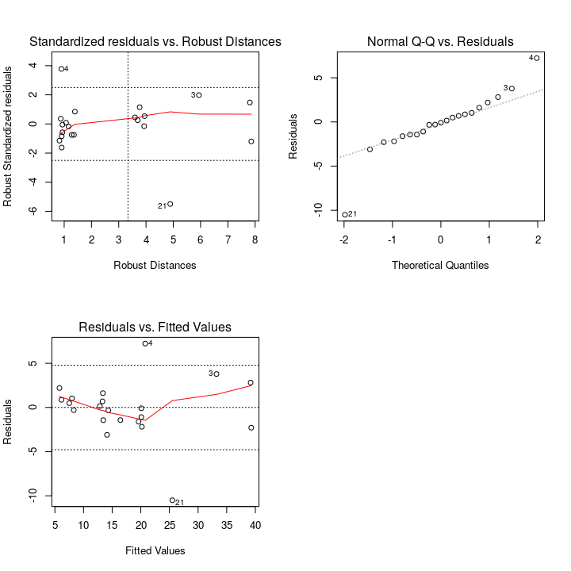
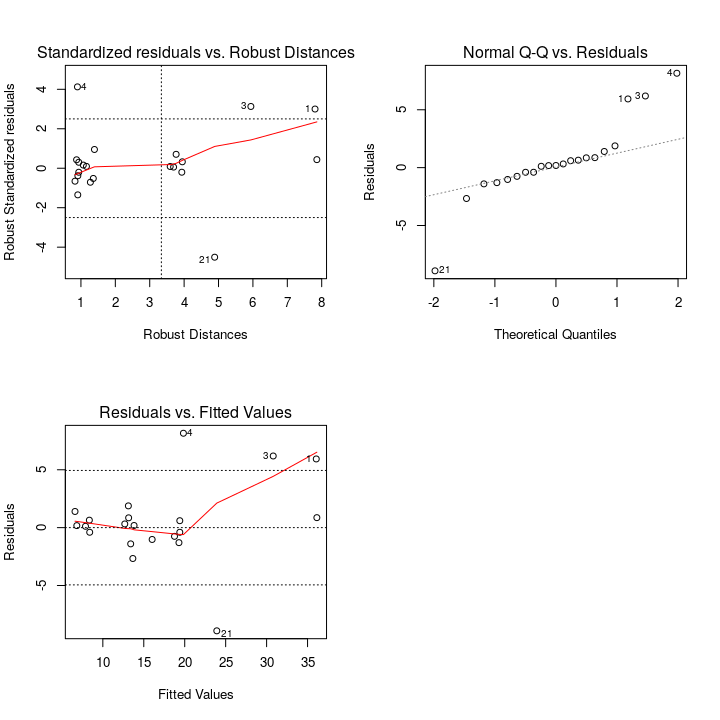
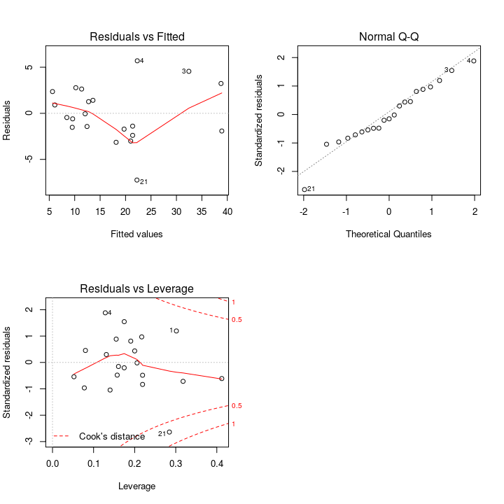
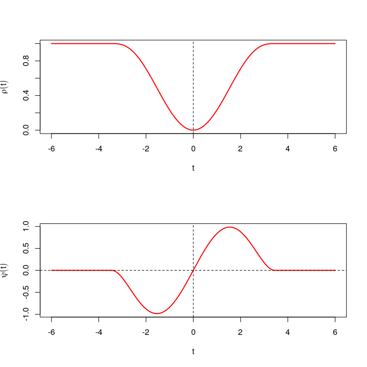
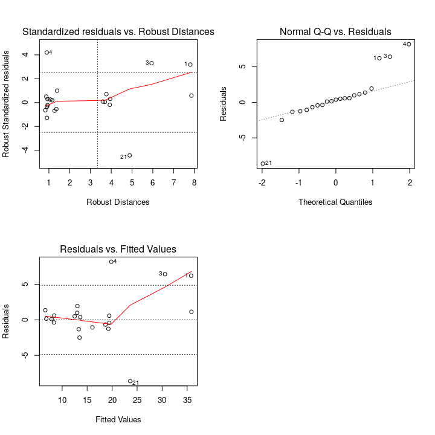

STAT547O - Lecture 2 notes
================
Matias Salibian-Barrera
2019-10-24

#### LICENSE

These notes are released under the "Creative Commons Attribution-ShareAlike 4.0 International" license. See the **human-readable version** [here](https://creativecommons.org/licenses/by-sa/4.0/) and the **real thing** [here](https://creativecommons.org/licenses/by-sa/4.0/legalcode).

Linear Regression
=================

In this section we discuss briefly a class of robust estimators for linear regression models (re-descending M-estimators). This class is known to have good robustness properties (e.g. high breakdown-point) and can be tuned to be highly-efficient when the errors follow a specific distribution. Moreover, the score / loss function can be chosen to improve their asymptotic bias. The main difficulty one encounters with these estimators is computational, since they require to find the minimum of a non-convex function in several dimensions. Much effort has been put in developing good algorithms, and two alternatives will be mentioned below.

M-estimators
------------

M-estimators for linear regression are the natural extension of M-estimators for location/scale models to the regression case. Their intuitive motivation is similar to that used for the location / scale model—start with a Gaussian MLE estimator and truncate the loss / score function. Such a monotone score function (corresponding to a convex loss function, but one that grows at a slower rate than the squared loss) was first proposed by Huber (1964, 1967, 1973). The corresponding regression estimators have bounded influence functions, but may have a very low breakdown point (as low as
1/*p*
, where
*p*
 is the number of features) if high-leverage outliers (outliers among the explanatory variables) can be present.

#### Fixed designs

When the explanatory variables are "fixed" (in the sense of being "controlled", as in a designed experiment, or because they are bounded, for example) then M-estimators with a monotone and bounded score function have high-breakdown point, and can be chosen to also be highly-efficient. For example, in this situation quantile regression (L1) estimators are robust (but not efficient). An effective strategy to obtain high-breakdown point and high-efficiency estimators in this case is as follows:

-   Compute the L1 regression estimator;
-   Compute an M-estimator of the scale of the corresponding residuals;
-   Use this auxiliary residual scale estimator to compute an M-estimator of regression (e.g. using Huber's loss function).

Note that since monotone score functions correspond to convex loss functions, the third step in the algorithm above is computationally relatively simple.

It is easy to see that estimators based on monotone score functions may have larger biases than those based on re-descending ones. So, a simple variation of the approach above that generally performs better is to use a bounded loss function for the last step above. Since this now implies optimizing a non-convex function, the computational complexity can be prohibitive. However, extensive numerical experiments showed that finding a "local minimum" starting from a "good" initial point yields an estimator with very good properties, and one that it is very simple to compute. The corresponding algorithm is:

-   Compute the L1 regression estimator;
-   Compute an M-estimator of the scale of the corresponding residuals;
-   Use this auxiliary residual scale estimator and the L1 regression estimator to start the iterations to compute an M-estimator with a re-descending score function.

#### Random features (explanatory variables)

When explanatory variables are observed (are part of the random phenomenon being measured), outliers and other atypical data points can be present. Observations that are outlying in the space of features are usually called high-leverage. When such points are present M-estimators for linear regression computed with a monotone score function (e.g. Huber's, or L1 \[quantile regression\]) may have a breakdown point as low as
1/*p*
, where
*p*
 is the number of features (for an illustration, see the first example in the [Lecture 1](Lecture1.md) notes). Some references include [Maronna et al, 1979](https://doi.org/10.1007/BFb0098492) and [Maronna & Yohai, 1991](https://doi.org/10.2307/2290400).

A solution to this problem is to use a bounded loss function
*ρ*
 instead. This results in a re-descending score function—a score function
*ψ*(*t*)
 that is zero for
|*t*|&gt;*c*
 for some
*c* &gt; 0
. In addition, note that bounded loss functions are necessarily non-convex, and that the optimization problem that defines these estimators may have several critical points that do not correspond to the global minimum. In general, computing these estimators can be challenging, but [Yohai, 1987](https://doi.org/10.1214/aos/1176350366) showed that it is enough to find a local minimum starting from a consistent estimator. This is discussed below in Sections "S-estimators" and "M-estimators with a preliminary scale".

The issue of scale
------------------

An often overlooked problem is that in order to use these estimators in practice we need to estimate the scale (standard deviation, if second moments exist) of the residuals (standardized residuals have to be used in the estimating equations). Naturally, this issue also afects M-estimators for location / scale, but for them it can be solved relatively easily by using the MAD of the observations, for example. Note that this robust residual scale estimator can be computed independently from the M-estimator. In regression models, however, there is no simple robust regression estimator that could be used to obtain reliable residuals, in order to compute a preliminary residual scale estimator. In other words, to compute a robust regression estimator we need a robust residual scale estimator. But to compute a robust residual scale estimator we need a robust regression estimator (in order to obtain reliable residuals). S-estimators (below) can break this impasse.

S-estimators
------------

S-estimators are defined as the regression coefficients that result in residuals that minimize a (robust) of scale. In particular, we use M-estimators of scale, because they are relatively easier to minimize than would be the case if used others (e.g. MAD). These regression estimators can be tuned to have high-breakdown point, but their efficiency is typically low. This is not a concern, as the resulting residual scale estimator is used to compute an M-estimator of regression that can be tuned to have high-efficiency.

#### Computational challenges

S-estimators can be difficult to compute. They are defined as the point at which a (typically) non-convex function attains its minimum. The loss function that needs to be minimized is only defined implicitly (as the solution to a non-linear equation). However, its gradient can be computed explicitly, and iterative algorithms that decrease the objective function at each step exist ([SB and Yohai, 2006](http://dx.doi.org/10.1198/106186006X113629)). The main computational bottleneck is the need for a "good" starting point. Data-dependent random starts have been used for a long time. This approach is implemented in the function `lmrob` of the package `robustbase`.

Here is a simple example, using the well-known stack loss data (see `help(stackloss)` for more information on these data). Note that the main objective of `lmrob()` is to compute the subsequent M-estimator, the S-estimator is included in one entry (`$init.S`) of the list returned by `lmrob()`.

``` r
data(stackloss)
set.seed(123)
a <- robustbase::lmrob(stack.loss ~ ., data=stackloss)
Sest <- a$init.S
coef(Sest)
```

    ##  (Intercept)     Air.Flow   Water.Temp   Acid.Conc. 
    ## -36.92541711   0.84957481   0.43047399  -0.07353894

We can look at the fitted vs. residuals plot, and easily identify 4 potential outliers.

``` r
plot(fitted(Sest), resid(Sest), pch=19, cex=1.1, 
     xlab='Fitted values', ylab='Residuals')
abline(h=Sest$scale*2.5*c(-1, 0, 1), lty=2)
n <- length(resid(Sest))
labels.id <- paste(1L:n)
iid <- 1:4
show.r <- sort.list(abs(resid(Sest)), decreasing = TRUE)[iid]
text(fitted(Sest)[show.r]-1.5, resid(Sest)[show.r], 
     show.r, cex = 1.1, xpd = TRUE, offset = 0.25)
```


M-estimators with a preliminary scale
-------------------------------------

The function `lmrob` in package `robusbase` implements M-estimators with a re-descending score (bounded loss) function, computed using a preliminary residual scale estimator (an S-estimator as above). This implementation uses data-dependent random starts for the S-estimator.

``` r
set.seed(123)
a <- robustbase::lmrob(stack.loss ~ ., data=stackloss)
par(mfrow=c(2,2))
plot(a, which=c(1, 2, 4))
par(mfrow=c(1,1))
```



Note that the M-estimator identifies fewer outliers than the S-estimator. This is because, by default, the M-estimator is tuned to have high-efficiency (95% if the errors have a Gaussian distribution), and this induces a relatively high asymptotic bias. If we reduce the efficiency to 85%, then the M-estimator resembles the S- one. We use the function `RobStatTM::bisquare()` to compute the tuning constant the corresponds to a desired efficiency, for regression estimators computed using Tukey's bisquare loss function.

``` r
library(robustbase)
set.seed(123)
myc <- lmrob.control(tuning.psi=RobStatTM::bisquare(.85))
a <- lmrob(stack.loss ~ ., data=stackloss, control=myc)
par(mfrow=c(2,2))
plot(a, which=c(1, 2, 4), id.n=4)
par(mfrow=c(1,1))
```


The function `lmrobdetMM` in package `RobStatTM` implements a different starting point for the iterative algorithm that computes the S-estimator. Instead of using data-dependent random starts, a few deterministic starting points are considered. The code below compares the resulting fit on the `stackloss` data:

``` r
library(RobStatTM)
set.seed(123)
myc <- lmrobdet.control(family='bisquare', efficiency=.85)
a.det <- lmrobdetMM(stack.loss ~ ., data=stackloss, control=myc)
par(mfrow=c(2,2))
plot(a.det, which=c(1, 2, 4), id.n=4)
par(mfrow=c(1,1))
```



We see that in this case, both estimators yield essentially the same fit

``` r
cbind(lmrob=coef(a), lmrobdetMM=coef(a.det))
```

    ##                    lmrob   lmrobdetMM
    ## (Intercept) -37.56200568 -37.58384225
    ## Air.Flow      0.81777030   0.81860785
    ## Water.Temp    0.54460331   0.54461166
    ## Acid.Conc.   -0.07326852  -0.07355833

The least squares fit only identifies a single potential mild outlier (observation 21), and the regression coefficients are somewhat different from the robust ones (specially for `Water.Temp` and `Acid.Conc.`)

``` r
a.ls <- lm(stack.loss ~ ., data=stackloss)
par(mfrow=c(2,2))
plot(a.ls, which=c(1, 2, 5))
par(mfrow=c(1,1))
```



``` r
cbind(ls=coef(a.ls), lmrob=coef(a), lmrobdetMM=coef(a.det))
```

    ##                      ls        lmrob   lmrobdetMM
    ## (Intercept) -39.9196744 -37.56200568 -37.58384225
    ## Air.Flow      0.7156402   0.81777030   0.81860785
    ## Water.Temp    1.2952861   0.54460331   0.54461166
    ## Acid.Conc.   -0.1521225  -0.07326852  -0.07355833

#### Choosing the score / loss function

For this class of M-estimators we can choose the family of loss/score functions, and the corresponding tuning constant. For example, Tukey's bisquare loss is
*ρ*(*t*)=min(*k*<sup>2</sup>/6, *k*<sup>2</sup>/6 \* (1 − (1 − (*t*/*k*)<sup>2</sup>)<sup>3</sup>))
. The next figures illustrate
*ρ*
 and its derivative
*ψ*
 (the corresponding score function):

``` r
tt <- seq(-6, 6, length=200)
tun.cnst <- bisquare(0.85)
par(mfrow=c(2,1))
plot(tt, rho(tt, family='bisquare', cc=tun.cnst), type='l', 
     lwd=2, col='red', xlab='t', ylab=expression(rho(t)))
abline(v=0, lty=2)
plot(tt, rhoprime(tt, family='bisquare', cc=tun.cnst), type='l', 
     lwd=2, col='red', xlab='t', ylab=expression(psi(t)))
abline(v=0, lty=2); abline(h=0, lty=2); par(mfrow=c(1,1))
```



The tuning constant is typically chosen to obtain an estimator with a desired efficiency when the errors follow a specific distribution. For example, the function `bisquare()` used above returns the value of the tuning parameter that should be used with Tukey's family of loss functions to obtain a desired efficiency when errors are Gaussian. Although the breakdown point of these estimators is high (as high as that of the auxiliary S-estimator for the residual scale, which can be chosen to be 50%), and their efficiency can then subsequently be set by selecting an appropriate tuning parameter, there is a bias / variance trade-off (the higher the efficiency (the lower the variance), the higher the asymptotic bias).

There is, however, another "parameter" that can be chosen to reduce the bias of the estimator (for a given breakdown point and efficiency)—the **family of loss functions** itself. The package `RobStatTM` implements the optimal loss function (`opt`), which can be set using the control argument in `lmrobdetMM` (see Section 5.8.1 in [Maronna et al, 2019](https://doi.org/10.1002/9781119214656)). Below we revisit the stack loss example, using a 95% efficient estimator computed with the bias-optimal loss, and compare it with the 85% efficient one based on the bisquare loss function.

``` r
library(RobStatTM)
set.seed(123)
myc <- lmrobdet.control(family='opt', efficiency=.95)
a.opt <- lmrobdetMM(stack.loss ~ ., data=stackloss, control=myc)
par(mfrow=c(2,2))
plot(a.opt, which=c(1, 2, 4), id.n=4)
par(mfrow=c(1,1))
```



Note that by using a loss function with better asymptotic bias properties we are able to detect all four outliers detected by the S-estimator but using a highly efficient and robust regression estimator, which results in better (e.g. more powerful) inference for the regression parameters. In other words, we obtain a more efficient regression estimator incurring in a much smaller increase in asymptotic bias, which results in better outlier-detection capabilities.

The estimated regression parameters are

``` r
cbind(ls=coef(a.ls), Tukey=coef(a.det), Opt=coef(a.opt))
```

    ##                      ls        Tukey          Opt
    ## (Intercept) -39.9196744 -37.58384225 -37.69568828
    ## Air.Flow      0.7156402   0.81860785   0.79745575
    ## Water.Temp    1.2952861   0.54461166   0.58160820
    ## Acid.Conc.   -0.1521225  -0.07355833  -0.06751118
