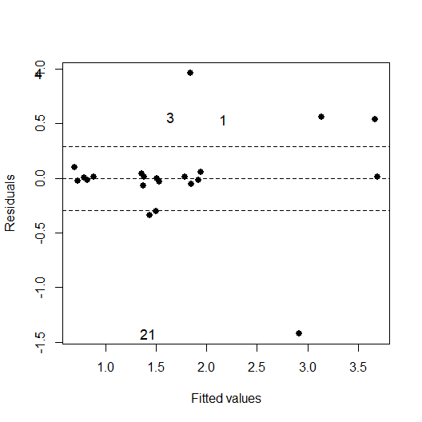

STAT547O - Lecture 2 notes
================
Matias Salibian-Barrera
2019-10-23

#### LICENSE

These notes are released under the “Creative Commons
Attribution-ShareAlike 4.0 International” license. See the
**human-readable version**
[here](https://creativecommons.org/licenses/by-sa/4.0/) and the **real
thing**
[here](https://creativecommons.org/licenses/by-sa/4.0/legalcode).

# Linear Regression

In this section we discuss briefly a class of robust estimators for
linear regression models (re-descending M-estimators). This class is
known to have good robustness properties (e.g. high breakdown-point) and
can be tuned to be highly-efficient when the errors follow a specific
distribution. Moreover, the score / loss function can be chosen to
improve their asymptotic bias. The main difficulty one encounters with
these estimators is computational, since they require to find the
minimum of a non-convex function in several dimensions. Much effort has
been put in developing good algorithms, and two alternatives will be
mentioned below.

## M-estimators

M-estimators for linear regression are the natural extension of
M-estimators for location/scale models. They can be intuitively
motivated in a similar way as those for the location / scale model
(start with a Gaussian MLE estimator and truncate the loss / score
function). Such a monotone score function (corresponding to a convex
loss function, but one that grows at a slower rate than the squared
loss) was first proposed by Huber (1964, 1967, 1981). The corresponding
regression estimators have bounded influence function, but may have a
very low breakdown point (as low as \[1/p\], where \[p\] is the number
of features) if high-leverale outliers are present. A solution is to use
a bounded loss function, which results in a re-descending score
function—a score function \[\psi(t)\] that is zero for \[|t| > c\] for
some \[c > 0\]. Note that bounded loss functions are necessarily
non-convex, and that the optimization problem that defines these
estimators may have several critical points that do not correspond to
the minimum. Computating these estimators can be challenging.

## The issue of scale

An often overlooked problem is that in order to use these estimators in
practice we need to estimate the scale (standard deviation, if second
moments exist) of the residuals (standardized residuals have to be used
in the estimating equations). Naturally, this issue also afects
M-estimators for location / scale, but for them it can be solved
relatively easily by using the MAD of the observations, for example.
Note that this robust residual scale estimator can be computed
independently from the M-estimator. In regression models, however, there
is no simple robust regression estimator that could be used to obtain
reliable residuals, in order to compute a preliminary residual scale
estimator. In other words, to compute a robust regression estimator we
need a robust residual scale estimator. But to compute a robust residual
scale estimator we need a robust regression estimator (in order to
obtain reliable residuals). S-estimators (below) can break this impasse.

## S-estimators

S-estimators are defined as the regression coefficients that result in
residuals that minimize a (robust) of scale. In particular, we use
M-estimators of scale, because they are relatively easier to minimize
than would be the case if used others (e.g. MAD). These regression
estimators can be tuned to have high-breakdown point, but their
efficiency is typically low. This is not a concern, as the resulting
residual scale estimator is used to compute an M-estimator of regression
that can be tuned to have high-efficiency.

#### Computational challenges

S-estimators can be difficult to compute. They are defined as the point
at which a typically non-convex function attains its minimum. The loss
function that needs to be minimized is only defined implicitly (as the
solution to a non-linear equation). However, its gradient can be
computed explicitly, and iterative algorithms that decrease the
objective function at each step exist ([SB and
Yohai, 2006](http://dx.doi.org/10.1198/106186006X113629)). The main
computational bottleneck is the need for a “good” starting point.
Data-dependent random starts have been used for a long time. This
approach is implemented in the function `lmrob` of the package
`robustbase`.

Here is a simple example, using the well-known stack loss data (see
`help(stackloss)` for more information on these data). Note that the
main objective of `lmrob()` is to compute the subsequent M-estimator,
the S-estimator is included in one entry (`$init.S`) of the list
returned by `lmrob()`.

``` r
data(stackloss)
set.seed(123)
a <- robustbase::lmrob(stack.loss ~ ., data=stackloss)
Sest <- a$init.S
coef(Sest)
```

    ##  (Intercept)     Air.Flow   Water.Temp   Acid.Conc. 
    ## -36.92541711   0.84957481   0.43047399  -0.07353894

We can look at the fitted vs. residuals plot, and easily identify 4
potential outliers.

``` r
Sest$scale # same as a$scale
```

    ## [1] 1.912354

``` r
plot(fitted(Sest), resid(Sest), pch=19, cex=1.1, 
     xlab='Fitted values', ylab='Residuals')
abline(h=Sest$scale*2.5*c(-1, 0, 1), lty=2)
n <- length(resid(Sest))
labels.id <- paste(1L:n)
iid <- 1:4
show.r <- sort.list(abs(resid(Sest)), decreasing = TRUE)[iid]
text(fitted(Sest)[show.r]-1.5, resid(Sest)[show.r], 
     show.r, cex = 1.1, xpd = TRUE, offset = 0.25)
```

<!-- -->

## M-estimators with a preliminary scale

The function `lmrob` in package `robusbase` implements M-estimators with
a re-descending score (bounded loss) function, computed using a
preliminary residual scale estimator (an S-estimator as above). This
implementation uses data-dependent random starts for the S-estimator.

``` r
set.seed(123)
a <- robustbase::lmrob(stack.loss ~ ., data=stackloss)
par(mfrow=c(2,2))
plot(a, which=c(1, 2, 4))
par(mfrow=c(1,1))
```

<!-- -->

Note that the M-estimator identifies fewer outliers than the
S-estimator. This is because, by default, the M-estimator is tuned to
have high-efficiency (95% if the errors have a Gaussian distribution),
and this induces a relatively high asymptotic bias. If we reduce the
efficiency to 85%, then the M-estimator resembles the S- one. We use the
function `RobStatTM::bisquare()` to compute the tuning constant the
corresponds to a desired efficiency, for regression estimators computed
using Tukey’s bisquare loss function.

``` r
library(robustbase)
set.seed(123)
myc <- lmrob.control(tuning.psi=RobStatTM::bisquare(.85))
a <- lmrob(stack.loss ~ ., data=stackloss, control=myc)
par(mfrow=c(2,2))
plot(a, which=c(1, 2, 4), id.n=4)
par(mfrow=c(1,1))
```

<!-- -->

#### Choosing the score / loss function
