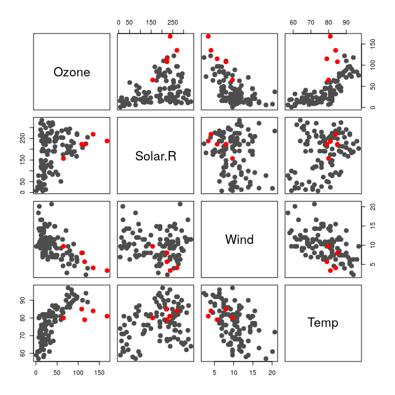
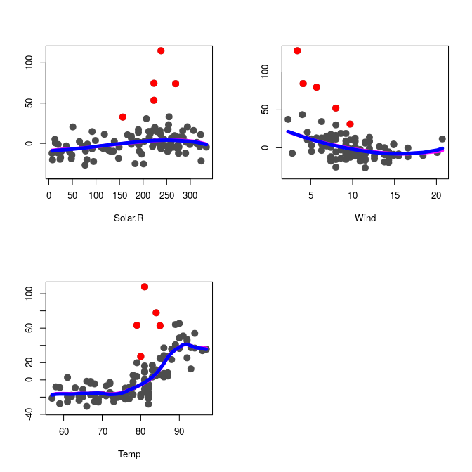

STAT547O - Lecture 3 notes
================
Matias Salibian-Barrera
2019-10-25

#### LICENSE

These notes are released under the "Creative Commons Attribution-ShareAlike 4.0 International" license. See the **human-readable version** [here](https://creativecommons.org/licenses/by-sa/4.0/) and the **real thing** [here](https://creativecommons.org/licenses/by-sa/4.0/legalcode).

Non-parametric regression
=========================

``` r
data(mcycle, package='MASS')
library(RBF)

tt <- with(mcycle, seq(min(times), max(times), length=200))
a <- backf.rob(Xp = mcycle$times, yp=mcycle$accel, windows=5, 
               point=as.matrix(tt), type='Tukey') 
plot(accel ~ times, data=mcycle, pch=19, col='gray50')
lines(tt, a$prediction+a$alpha, col='tomato3', lwd=3)
b <- backf.rob(Xp = mcycle$times, yp=mcycle$accel, windows=5, 
               point=as.matrix(tt), degree=2, type='Tukey')
lines(tt, b$prediction+b$alpha, col='blue3', lwd=3)
```


### Another example

Here is a (longish) example on how `RBF` works. We use the Air Quality data.

``` r
library(RBF)
data(airquality)
x <- airquality
x <- x[ complete.cases(x), ]
x <- x[, c('Ozone', 'Solar.R', 'Wind', 'Temp')]
y <- as.vector(x$Ozone)
x <- as.matrix(x[, c('Solar.R', 'Wind', 'Temp')])
```

A scatter plot of the data

``` r
pairs(cbind(y,x), labels=c('Ozone', colnames(x)), pch=19, col='gray30', cex=1.5)
```


The following bandwidths were obtained via a robust leave-one-out cross-validation procedure (described in the paper). Here we just set them to their optimal values:

``` r
bandw <- c(136.728453,   8.894283,   4.764985)
```

Now we use the robust backfitting algorithm to fit an additive model using Tukey's bisquare loss (the default tuning constant for this loss function is 4.685)

``` r
fit.full <- backf.rob(Xp=x, yp=y, windows=bandw, epsilon=1e-6, 
                     degree=1, type='Tukey')
```

We display the 3 fits (one per additive component), being careful with the axis limits

``` r
lim.cl <- lim.rob <- matrix(0, 2, 3)
par(mfrow=c(2,2))
for(j in 1:3) {
  re <- y - fit.full$alpha - rowSums(fit.full$g.matrix[,-j])
  lim.rob[,j] <- c(min(re), max(re))
  plot(re ~ x[,j], type='p', pch=19, col='gray30', xlab=colnames(x)[j], ylab='', cex=1.5)
  oo <- order(x[,j])
  lines(x[oo,j], fit.full$g.matrix[oo,j], lwd=5, col='blue')
}
```


We now compute and display the classical backfitting fits, with bandwidths chosen via leave-one-out CV

``` r
bandw.cl <- c(91.15, 10.67, 9.53)
fit.cl <- backf.cl(Xp=x, yp=y, windows=bandw.cl, epsilon=1e-6,
                   degree=1)
par(mfrow=c(2,2))
for(j in 1:3) {
  re <- y - fit.cl$alpha - rowSums(fit.cl$g.matrix[,-j])
  lim.cl[,j] <- c(min(re), max(re))
  plot(re ~ x[,j], type='p', pch=19, col='gray30', xlab=colnames(x)[j], ylab='', cex=1.5)
  oo <- order(x[,j])
  lines(x[oo,j], fit.cl$g.matrix[oo,j], lwd=5, col='magenta')
}
```


The following plots are partial residual plots with both the classical and robust fits on them

``` r
lims <- lim.cl
for(j in 1:3) {
  lims[1,j] <- min(lim.cl[1,j], lim.rob[1,j])
  lims[2,j] <- max(lim.cl[2,j], lim.rob[2,j])
}
par(mfrow=c(2,2))
for(j in 1:3) {
  re <- y - fit.cl$alpha - rowSums(fit.cl$g.matrix[,-j])
  plot(re ~ x[,j], type='p', pch=19, col='gray30', xlab=colnames(x)[j], ylab='', cex=1.5,
      ylim=lims[,j])
  oo <- order(x[,j])
  lines(x[oo,j], fit.cl$g.matrix[oo,j], lwd=5, col='magenta')
  lines(x[oo,j], fit.full$g.matrix[oo,j], lwd=5, col='blue')
}
```


We look at the residuals from the robust fit to identify potential outiers

``` r
re.ro <- y - fit.full$alpha - rowSums(fit.full$g.matrix)
ou.ro <- boxplot(re.ro, plot=FALSE)$out
n <- length(re.ro)
ou.ro <- (1:n)[ re.ro %in% ou.ro ]
boxplot(re.ro, col='gray80', pch=19, cex=1.5)
points(rep(1, length(ou.ro)), re.ro[ou.ro], pch=19, cex=2, col='red')
```


We highlight these suspicious observations on the scatter plot

``` r
cs <- rep('gray30', nrow(x))
cs[ou.ro] <- 'red'
os <- 1:nrow(x)
os2 <- c(os[-ou.ro], os[ou.ro])
pairs(cbind(y,x)[os2,], labels=c('Ozone', colnames(x)), pch=19, col=cs[os2], cex=1.5)
```



and on the partial residuals plots

``` r
par(mfrow=c(2,2))
for(j in 1:3) {
  re <- y - fit.full$alpha - rowSums(fit.full$g.matrix[,-j])
  plot(re ~ x[,j], type='p', pch=19, col='gray30', xlab=colnames(x)[j], ylab='', cex=1.5,
       ylim=lims[,j])
  points(re[ou.ro] ~ x[ou.ro,j], pch=19, col='red', cex=1.5)
  oo <- order(x[,j])
  lines(x[oo,j], fit.cl$g.matrix[oo,j], lwd=5, col='magenta')
  lines(x[oo,j], fit.full$g.matrix[oo,j], lwd=5, col='blue')
}
```


If we use the classical backfitting algorithm on the data without the potential outliers, we obtain almost identical results

``` r
# Run the classical backfitting algorithm without outliers
x2 <- x[-ou.ro,]
y2 <- y[-ou.ro]
bandw.cl2 <- c(138.87, 10.52, 4.85)
fit.cl2 <- backf.cl(Xp=x2, yp=y2, windows=bandw.cl2, epsilon=1e-6,
                   degree=1)
par(mfrow=c(2,2))
for(j in 1:3) {
  re <- y - fit.full$alpha - rowSums(fit.full$g.matrix[,-j])
  plot(re ~ x[,j], type='p', pch=19, col='gray30', xlab=colnames(x)[j], ylab='', cex=1.5,
       ylim=lims[,j])
  points(re[ou.ro] ~ x[ou.ro,j], pch=19, col='red', cex=1.5)
  oo <- order(x2[,j])
  lines(x2[oo,j], fit.cl2$g.matrix[oo,j], lwd=5, col='magenta')
  oo <- order(x[,j])
  lines(x[oo,j], fit.full$g.matrix[oo,j], lwd=5, col='blue')
}
```



<!-- Add outliers? -->
<!-- ```{r cycle2, fig.width=6, fig.height=6}  -->
<!-- x0 <- mcycle -->
<!-- set.seed(123) -->
<!-- x0 <- rbind(x0, cbind(times=rnorm(10, mean=20, sd=3),  -->
<!--                         accel=rnorm(10, mean=50, sd=2))) -->
<!-- tt <- with(x0, seq(min(times), max(times), length=200)) -->
<!-- a <- backf.rob(Xp = x0$times, yp=x0$accel, windows=5, point=as.matrix(tt), type='Tukey')  -->
<!-- plot(accel ~ times, data=x0, pch=19, col='gray50') -->
<!-- lines(tt, a$prediction+a$alpha, col='tomato3', lwd=3) -->
<!-- b <- backf.rob(Xp = x0$times, yp=x0$accel, windows=5, point=as.matrix(tt), degree=2, type='Tukey') -->
<!-- lines(tt, b$prediction+b$alpha, col='blue3', lwd=3) -->
<!-- ``` -->
