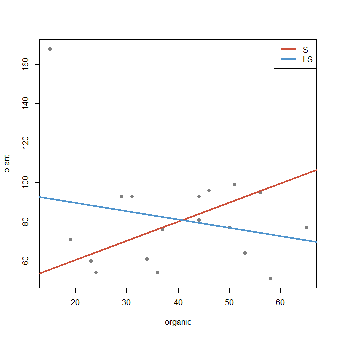

STAT547O - Lecture notes
================
Matias Salibian-Barrera
2019-11-03

#### LICENSE

These notes are released under the “Creative Commons
Attribution-ShareAlike 4.0 International” license. See the
**human-readable version**
[here](https://creativecommons.org/licenses/by-sa/4.0/) and the **real
thing**
[here](https://creativecommons.org/licenses/by-sa/4.0/legalcode).

# Simple examples of linear and non-parametric regression

### Simple linear regression

We will compute an S-estimator “by hand”. We will use a loss function in
Tukey’s family of bisquare functions. We compute a tuning constant that
yields \[E(\rho(Z)) = 1/2\], where \[Z\] is a N(0,1) random variable. In
this way we obtain consistency of the M-scale estimator, and maximum
asymptotic breakdown point.

The following code uses the function `lmrobdet.control` to compute the
tuning constant (given the family of functions and the desired value of
\[E(\rho(Z)))\].

``` r
library(RobStatTM)
# we use bisquare, find constant to have E(\rho(Z)) = 1/2
cc <- lmrobdet.control(family='bisquare', bb=.5)$tuning.chi
```

We now check that in fact, this constant works. In what follows we
compute Tukey’s loss function using `rho(..., family='bisquare')`, and
later we will use its derivative `rhoprime(..., family='bisquare')`.
These functions are available in the package `RobStatTM`.

``` r
integrate(function(a, family, cc=cc) rho(a, family=family, cc=cc)*dnorm(a), 
          lower=-Inf, upper=+Inf, family='bisquare', cc=cc)$value
```

    ## [1] 0.5

We will use the `phosphor` data. Details can be found using
`help(phosphor, package='RobStatTM')`. The response is `plant` and, to
simplify the example, we select only one explanatory variable,
`organic`. In these notes we will not use the implementation of
S-estimators available in the `robustbase` and `RobStatTM` packages, but
rather compute them **by hand**. In order to illustrate the impact of
outliers, we will change the position of the real outlier (from the
right end of the plot, to the left).

``` r
data(phosphor, package='robustbase')
library(RobStatTM)
# artificially change the location of the outlier 
# for illustration purposes
phosphor[17, 'organic'] <- 15
plot(plant ~ organic, data=phosphor, pch=19, col='gray50')
```

<!-- -->

As discussed in class, S-estimators, can be shown to solve the
first-order optimality conditions of an M-estimator of regression,
computed using the final scale estimator (the one corresponding to the
S-estimator). Although this result in itself is not useful to compute
the S-estimator directly (because to use it we would need to know the
residual scale associated to the regression estimator we want to
compute), it does suggest an iterative weighted least squares scheme.
This is what we use here. First we create the **design matrix** `x` and
the **response vector** `y`:

``` r
n <- nrow(phosphor)
xx <- cbind(rep(1, n), phosphor$organic)
y <- phosphor$plant
```

We now find a random start for our iterative algorithm, using the fit to
2 randomly chosen observations:

``` r
set.seed(123)
(ii <- sample(n, 2))
```

    ## [1] 15 14

``` r
beta <- coef(lm(plant ~ organic, data=phosphor, subset=ii))
```

We start the iterations from this `beta`, and run it 100 steps (we will
*check for convergence* rather informally by looking at the sequence of
M-estimators of residual scale, that we save in the vector `sis`). In
each step we use the function `RobStatTM::mscale` to compute the
M-estimator of scale.

``` r
# start iterations
sis <- vector('numeric', 100)
for(j in 1:100) {
  re <- as.vector(y - xx %*% beta) 
  sis[j] <- si.hat <- mscale(re, tuning.chi=cc, family='bisquare') 
  ww <- rhoprime(re/si.hat, family='bisquare', cc=cc) / (re/si.hat)
  beta <- solve( t(xx) %*% (xx*ww), t(xx * ww) %*% y) 
}
```

“Check” that the algorithm converged:

``` r
plot(sis, pch=19, col='gray30', xlab='Iteration', ylab='Sigma hat')
```

<!-- -->

And also

``` r
sis
```

    ##   [1] 25.67114 21.54944 21.01483 20.71286 20.50401 20.35595 20.25298
    ##   [8] 20.18321 20.13700 20.10685 20.08724 20.07439 20.06574 20.05965
    ##  [15] 20.05511 20.05149 20.04843 20.04568 20.04313 20.04068 20.03829
    ##  [22] 20.03594 20.03359 20.03126 20.02892 20.02658 20.02427 20.02197
    ##  [29] 20.01972 20.01754 20.01545 20.01346 20.01161 20.00992 20.00840
    ##  [36] 20.00707 20.00591 20.00495 20.00415 20.00352 20.00301 20.00261
    ##  [43] 20.00231 20.00208 20.00192 20.00179 20.00170 20.00164 20.00159
    ##  [50] 20.00156 20.00153 20.00152 20.00150 20.00150 20.00149 20.00149
    ##  [57] 20.00148 20.00148 20.00148 20.00148 20.00148 20.00148 20.00148
    ##  [64] 20.00148 20.00148 20.00148 20.00148 20.00148 20.00148 20.00148
    ##  [71] 20.00148 20.00148 20.00148 20.00148 20.00148 20.00148 20.00148
    ##  [78] 20.00148 20.00148 20.00148 20.00148 20.00148 20.00148 20.00148
    ##  [85] 20.00148 20.00148 20.00148 20.00148 20.00148 20.00148 20.00148
    ##  [92] 20.00148 20.00148 20.00148 20.00148 20.00148 20.00148 20.00148
    ##  [99] 20.00148 20.00148

We now show the S-regression estimator, in red, and the least squares
one, in blue:

``` r
beta.S <- beta
plot(plant ~ organic, data=phosphor, pch=19, col='gray50')
abline(beta.S, lwd=3, col='tomato3')
abline(lm(plant ~ organic, data=phosphor), lwd=3, col='steelblue3')
legend('topright', lwd=3, lty=1, col=c('tomato3', 'steelblue3'), 
       legend=c('S', 'LS'))
```

<!-- -->

Furthermore, compare these estimators with the LS one without the
outlier:

``` r
plot(plant ~ organic, data=phosphor, pch=19, col='gray50')
abline(beta.S, lwd=3, col='tomato3')
abline(lm(plant ~ organic, data=phosphor), lwd=3, col='steelblue3')
abline(lm(plant ~ organic, data=phosphor, subset=-17), lwd=3, col='green3')
legend('topright', lwd=3, lty=1, col=c('tomato3', 'steelblue3', 'green3'), 
       legend=c('S', 'LS', 'LS(clean)'))
```

<!-- -->

We now use the S-estimator as a starting point to compute a more
efficient M-estimator of regression, using residual scale associated
with the S-estimator. The “rho” function is in the same family, but the
tuning constant changes. We also use 100 iterations, and note that we do
not update the residual M-scale estimator:

``` r
cc2 <- lmrobdet.control(family='bisquare', bb=.5)$tuning.psi
for(j in 1:100) {
  re <- as.vector(y - xx %*% beta)
  ww <- rhoprime(re/si.hat, family='bisquare', cc=cc2) / (re/si.hat)
  beta <- solve( t(xx) %*% (xx*ww), t(xx * ww) %*% y) 
}
```

We now plot all estimators computed so far:

``` r
beta.M <- beta
plot(plant ~ organic, data=phosphor, pch=19, col='gray50')
abline(beta.S, lwd=3, col='tomato3')
abline(lm(plant ~ organic, data=phosphor), lwd=3, col='steelblue3')
abline(lm(plant ~ organic, data=phosphor, subset=-17), lwd=3, col='green3')
abline(beta.M, lwd=3, col='magenta3')
legend('topright', lwd=3, lty=1, 
       col=c('tomato3', 'steelblue3', 'green3', 'magenta3'), 
       legend=c('S', 'LS', 'LS(clean)', 'MM'))
```

<!-- -->

Note that, unlike the S-estimator, the MM-estimator is indistinguishable
from the LS estimator computed on the clean data. This is the desired
result of using an efficient and robust estimator.

#### A bad start

``` r
phosphor[17, 'organic'] <- 15
beta <- coef(lm(plant ~ organic, data=phosphor))
beta <- c(300, -2)
for(j in 1:100) {
  re <- as.vector(y - xx %*% beta) 
  sis[j] <- si.hat <- mscale(re, tuning.chi=cc, family='bisquare') 
  ww <- rhoprime(re/si.hat, family='bisquare', cc=cc) / (re/si.hat)
  beta <- solve( t(xx) %*% (xx*ww), t(xx * ww) %*% y) 
}
plot(plant ~ organic, data=phosphor, pch=19, col='gray50')
abline(beta, lwd=3, col='hotpink')
abline(lm(plant ~ organic, data=phosphor), lwd=3, col='steelblue3')
```

<!-- -->

<!-- # a2 <- robustbase::lmrob(plant ~ organic, data=phosphor) -->

<!-- # beta2 <- a2$init.S$coef -->

<!-- # re2 <- as.vector(y - xx%*%beta2) -->

<!-- # sum( rho(re2/a2$init.S$scale, family='bisquare', cc=cc) ) / 16 -->

<!-- # sum( rho(re/si.hat, family='bisquare', cc=cc) ) / 16 -->

<!-- ```{r u} -->

<!-- myc <- lmrobdet.control(family='bisquare', efficiency=0.85) -->

<!-- ph.M <- lmrobM(plant ~ inorg, data=phosphor, control=myc) -->

<!-- plot(plant ~ inorg, data=phosphor, pch=19, cex=1.2) -->

<!-- abline(ph.M, lwd=2, col='tomato3') -->

<!-- legend(5, 160, legend='lmrobM fit', lwd=2, col='tomato3') -->

<!-- ``` -->

### Non-parametric regression

Consider the motorcycle acceleration data

``` r
data(mcycle, package='MASS')
plot(accel ~ times, data=mcycle, pch=19, col='gray50')
```

<!-- -->

We will compute a Kernel M-estimator at `x0 = 17`. We first need an
estimator of the residual scale. Looking at the plot, it does not seem
reasonable to assume a homogeneous model, so we look for a *local*
residual scale estimator. We use a bandwidth `h = 3`. The local MAD
(using a local median estimator) is

``` r
si.hat <- with(mcycle, mad( accel[ abs(times-17) < 3] ) )
```

Note that residuals with respect to a local L1 estimator would be much
smaller

``` r
ii <- with(mcycle, which( abs(times-17) < 3) )
si.hat2 <- mad( resid( quantreg::rq(accel ~ times, data=mcycle, subset=ii) ) )
```

``` r
library(RBF)
tt <- with(mcycle, seq(min(times), max(times), length=200))
a <- backf.rob(Xp = mcycle$times, yp=mcycle$accel, windows=5, 
               point=as.matrix(tt), type='Tukey') 
plot(accel ~ times, data=mcycle, pch=19, col='gray50')
lines(tt, a$prediction+a$alpha, col='tomato3', lwd=3)
b <- backf.rob(Xp = mcycle$times, yp=mcycle$accel, windows=5, 
               point=as.matrix(tt), degree=2, type='Tukey')
lines(tt, b$prediction+b$alpha, col='blue3', lwd=3)
```

<!-- -->

``` r
plot(accel ~ times, data=mcycle, pch=19, col='gray50')
```

<!-- -->

``` r
a <- mgcv::gam(accel ~ s(times, bs='cr'), data=mcycle, family='gaussian')
plot(a, resid=TRUE, pch=19, cex=.9)
```

<!-- -->

``` r
predict(a, newdata=data.frame(times=17))
```

    ##         1 
    ## -66.53594
